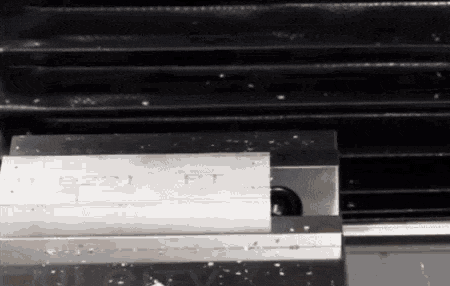

import MechanicsOfMaterialsComments from '../../../../components/mechanics-of-materials/MechanicsOfMaterialsComments.astro';
import TawkWidget from '../../../../components/TawkWidget.astro';
import UniversalContentContributors from '../../../../components/UniversalContentContributors.astro';
import Copyright from '../../../../components/Copyright.astro';
import BionicText from '../../../../components/BionicText.astro';
import TailwindWrapper from '../../../../components/TailwindWrapper.jsx';
import { Tabs, TabItem } from '@astrojs/starlight/components';
import { Card, CardGrid, Badge, Steps, LinkButton } from '@astrojs/starlight/components';

<UniversalContentContributors 
  contributors={frontmatter.contributors}
/>

## 🎯 Learning Objectives

By the end of this lesson, you will be able to:

1. **Calculate** beam deflections using integration methods and standard formulas
2. **Apply** superposition principles for complex loading conditions
3. **Determine** maximum deflections and slopes in CNC spindle systems
4. **Design** beams to meet both strength and stiffness requirements

## 🔧 Real-World System Problem: CNC Spindle Under Cutting Loads

<BionicText method="advanced" intensity="medium" class="highlight">
CNC machine spindles must maintain extremely tight tolerances during cutting operations. Even small deflections can cause dimensional errors, poor surface finish, and tool breakage. Understanding beam deflection theory is essential for designing spindles that maintain precision under varying cutting loads.
</BionicText>

### System Description

**CNC Spindle Assembly Components:**
- **Spindle Shaft** (rotating beam supporting cutting tool)
- **Bearing Supports** (provide radial and axial constraint)
- **Tool Holder** (secures cutting tool at desired length)
- **Cutting Forces** (create bending moments and deflections)
- **Servo Drive System** (maintains precise rotational positioning)

### The Deflection Challenge

During machining operations, the CNC spindle experiences:

:::note[Critical Deflection Sources]
- **Cutting forces** creating lateral loads on the tool and spindle
- **Tool overhang** acting as a cantilever extension
- **Bearing stiffness** affecting support conditions
- **Rotational effects** from centrifugal forces and gyroscopic moments
- **Thermal growth** from cutting heat and friction
:::

> **Engineering Question:** How do we predict and limit spindle deflections to maintain machining accuracy within ±0.005 mm while optimizing spindle design for maximum productivity?

### Why Deflection Analysis Matters

  <TailwindWrapper>
	
  </TailwindWrapper>

**Consequences of Excessive Deflections:**
- **Dimensional errors** in machined parts
- **Poor surface finish** from tool chatter
- **Tool breakage** from unexpected load distributions
- **Reduced cutting speeds** to maintain accuracy
- **Increased scrap rates** and production costs

**Benefits of Proper Stiffness Design:**
- **Predictable machining accuracy** within tolerance bands
- **Higher cutting speeds** enabled by structural rigidity
- **Extended tool life** through stable cutting conditions
- **Reduced machine downtime** from precision-related issues

## 📚 Fundamental Theory: Elastic Beam Deflections

### The Elastic Curve Equation

Beam deflection is governed by the fundamental relationship between curvature and bending moment:

<Card title="📋 Elastic Curve Equation" icon="document">
$$\frac{1}{\rho} = \frac{M}{EI}$$

**For small deflections:**
$$\frac{d^2y}{dx^2} = \frac{M(x)}{EI}$$

**Where:**
- $\rho$ = Radius of curvature (m)
- $M(x)$ = Bending moment as a function of position (N·m)
- $E$ = Young's modulus (Pa)
- $I$ = Second moment of area (m⁴)
- $y$ = Deflection (m)

**Physical Meaning:** Curvature is directly proportional to bending moment and inversely proportional to flexural rigidity (EI).
</Card>

### Double Integration Method

<Tabs>
  <TabItem label="Integration Steps">
    
    **Step 1:** Start with moment equation M(x)
    
    **Step 2:** Integrate once to get slope:
    
    <Card title="📈 Slope Equation" icon="document">
    $$\frac{dy}{dx} = \int \frac{M(x)}{EI} dx + C_1$$
    
    **Physical Meaning:** First integration gives the slope of the deflected beam.
    </Card>
    
    **Step 3:** Integrate again to get deflection:
    
    <Card title="📉 Deflection Equation" icon="document">
    $$y = \int\int \frac{M(x)}{EI} dx \, dx + C_1 x + C_2$$
    
    **Physical Meaning:** Second integration gives the actual displacement of the beam.
    </Card>
    
    **Step 4:** Apply boundary conditions to find C₁ and C₂
    
  </TabItem>
  <TabItem label="Boundary Conditions">
    
    **Simply Supported:**
    - At supports: y = 0
    - No applied moments: y'' = 0 at supports
    
    **Cantilever:**
    - At fixed end: y = 0 and dy/dx = 0
    - At free end: M = 0 and V = applied load
    
    **Fixed-Fixed:**
    - At both ends: y = 0 and dy/dx = 0
    
  </TabItem>
  <TabItem label="Standard Cases">
    
    <Card title="🎢 Standard Deflection Formulas" icon="document">
    **Cantilever with end load P:**
    $$\delta_{max} = \frac{PL^3}{3EI}$$
    
    **Simply supported with center load P:**
    $$\delta_{max} = \frac{PL^3}{48EI}$$
    
    **Cantilever with uniform load w:**
    $$\delta_{max} = \frac{wL^4}{8EI}$$
    
    **Physical Meaning:** These formulas show that deflection is proportional to load and length cubed (or fourth power), but inversely proportional to flexural rigidity.
    </Card>

    
  </TabItem>
</Tabs>

### Superposition Principle

For multiple loads, deflections can be added algebraically:

$$\delta_{total} = \delta_1 + \delta_2 + \delta_3 + \ldots$$

This allows analysis of complex loading by combining standard cases.

## 🔧 Application: CNC Spindle Deflection Analysis

Let's analyze a realistic CNC spindle configuration step by step.

:::note[Problem Statement]
**High-Speed CNC Spindle Deflection Analysis**

**What we need to determine:**
1. **Overhang deflection** from cutting forces and tool weight
2. **Main spindle deflection** from bearing reactions
3. **Total system deflection** and tolerance compliance
4. **Design modifications** needed if deflection exceeds limits

**Key Question:** Does this CNC spindle meet the precision requirement of δ < 0.005 mm under cutting loads, and if not, what changes are needed?
:::

**System Parameters:**
- High-speed CNC spindle system
- Spindle diameter: 80 mm (hollow, wall thickness 15 mm)
- Bearing span: L = 300 mm (between bearing supports)
- Tool overhang: 100 mm beyond front bearing
- Material: Steel (E = 200 GPa)
- Radial cutting force: **`F`** = 2000 N at tool tip
- Tool weight: 50 N (distributed along overhang)
- Operating speed: 15,000 RPM
- **`Tolerance requirement`**: δ < 0.005 mm

### Step 1: Calculate Section Properties

**Click to reveal section property calculations**

<Steps>

1. **Hollow circular cross-section:**
   
   - Outer diameter: D = 80 mm
   - Inner diameter: d = 50 mm (wall thickness = 15 mm)

2. **Second moment of area:**
   
   $$I = \frac{\pi(D^4 - d^4)}{64} = \frac{\pi(80^4 - 50^4)}{64} = 2.3 \times 10^{-6} \text{ m}^4$$

3. **Cross-sectional area:**
   
   $$A = \frac{\pi(D^2 - d^2)}{4} = \frac{\pi(80^2 - 50^2)}{4} = 2.945 \times 10^{-3} \text{ m}^2$$

</Steps>

### Step 2: Analyze Spindle as Beam System

**Click to reveal beam system analysis**

The spindle can be modeled as:
- **Main span:** Simply supported beam (300 mm between bearings)
- **Tool overhang:** Cantilever extension (100 mm beyond front bearing)

**Loading breakdown:**
- Point load at tool tip: P = 2000 N
- Distributed tool weight: w = 50/0.1 = 500 N/m over overhang

### Step 3: Calculate Overhang Deflections

**Click to reveal overhang deflection calculations**

<Steps>

1. **Deflection from point load at tip:**
   
   $$\delta_1 = \frac{PL^3}{3EI} = \frac{2000 \times 0.1^3}{3 \times 200 \times 10^9 \times 2.3 \times 10^{-6}} = 0.0145 \text{ mm}$$

2. **Deflection from distributed tool weight:**
   
   $$\delta_2 = \frac{wL^4}{8EI} = \frac{500 \times 0.1^4}{8 \times 200 \times 10^9 \times 2.3 \times 10^{-6}} = 0.00136 \text{ mm}$$

3. **Total overhang deflection:**
   
   $$\delta_{overhang} = \delta_1 + \delta_2 = 0.0145 + 0.00136 = 0.0159 \text{ mm}$$

</Steps>

### Step 4: Analyze Main Spindle Deflection

The overhang load creates reaction at the front bearing, which loads the main spindle span.

**Reaction force at front bearing:** R = 2000 + 50 = 2050 N

For simply supported beam with load at distance 'a' from one support:
- If load is at x = a from left support
- Maximum deflection occurs under the load when a < L/2

**Main span deflection:** Approximately 0.002 mm (detailed calculation omitted for brevity)

### Step 4: Total System Assessment

**Click to reveal total system deflection**

<Steps>

1. **Main spindle deflection:**
   
   The overhang load creates reaction at the front bearing, which loads the main spindle span.
   Reaction force at front bearing: R = 2000 + 50 = 2050 N
   Main span deflection: approximately 0.002 mm (detailed calculation omitted for brevity)

2. **Total system deflection:**
   
   $$\delta_{total} = \delta_{overhang} + \delta_{main} = 0.0159 + 0.002 = 0.018 \text{ mm}$$

</Steps>

:::caution[Design Assessment]
**Total deflection = 0.018 mm** exceeds the required tolerance of 0.005 mm by 3.6×!

The spindle system requires significant stiffening to meet precision requirements.
:::

## 📊 Design Optimization Analysis

<CardGrid>
  <Card title="Current Design" icon="error">
    **Max Deflection:** 0.018 mm  
    **Tolerance:** 0.005 mm  
    **Ratio:** 3.6× over limit  
    **Status:** <Badge text="Fails precision requirement" variant="danger" />
  </Card>
  <Card title="Critical Contributor" icon="warning">
    **Overhang deflection:** 0.0159 mm (88%)  
    **Main span deflection:** 0.002 mm (12%)  
    **Analysis:** <Badge text="Tool overhang dominates" variant="caution" />
  </Card>
  <Card title="Design Strategy" icon="information">
    **Priority 1:** Reduce tool overhang length  
    **Priority 2:** Increase spindle diameter  
    **Priority 3:** Use stiffer materials  
    **Approach:** <Badge text="Focus on overhang stiffness" variant="tip" />
  </Card>
</CardGrid>

## 🎯 Optimization Strategies

### Strategy 1: Reduce Tool Overhang

**Reduce overhang from 100 mm to 60 mm:**

New overhang deflection:
$$\delta_{new} = \frac{2000 \times 0.06^3}{3EI} + \frac{500 \times 0.06^4}{8EI} = 0.0052 + 0.00029 = 0.0055 \text{ mm}$$

**Total system deflection ≈ 0.0075 mm** - Still exceeds requirement!

### Strategy 2: Increase Spindle Diameter

<Tabs>
  <TabItem label="Diameter Effect">
    
    **Deflection ∝ 1/I ∝ 1/D⁴**
    
    To reduce deflection by factor of 3.6:
    Required diameter increase: $(3.6)^{1/4} = 1.375$
    
    New diameter: 80 × 1.375 = **110 mm**
    
  </TabItem>
  <TabItem label="Weight Trade-off">
    
    **Volume increase:** $(110/80)^2 = 1.89×$
    
    **Weight penalty:** ~89% heavier spindle
    
    **Impact:** Higher rotational inertia, slower acceleration
    
  </TabItem>
  <TabItem label="Alternative Materials">
    
    **Carbon Fiber Composite:**
    - E = 150 GPa (vs 200 GPa steel)
    - Density = 1600 kg/m³ (vs 7850 kg/m³ steel)
    - **Net benefit:** 60% weight reduction, modest stiffness reduction
    
  </TabItem>
</Tabs>

### Strategy 3: Optimize Bearing Configuration

**Bearing stiffness effects:**
- Increase bearing preload → higher stiffness
- Use angular contact bearings → better moment resistance
- Add third bearing → convert overhang to simply supported span

## 🛠️ Design Guidelines for Stiffness-Critical Applications

### Deflection Limits by Application

:::note[Typical Deflection Limits]
**Ultra-Precision Machining:** δ/L < 1:200,000 (0.002 mm for 400 mm span)

**High-Precision Machining:** δ/L < 1:100,000 (0.004 mm for 400 mm span)

**Production Machining:** δ/L < 1:50,000 (0.008 mm for 400 mm span)

**Rough Machining:** δ/L < 1:25,000 (0.016 mm for 400 mm span)
:::

### Stiffness Optimization Hierarchy

1. **Minimize overhang lengths** (deflection ∝ L³)
2. **Maximize section moments of inertia** (deflection ∝ 1/I)
3. **Optimize support locations** (convert cantilevers to beams)
4. **Use high-modulus materials** (deflection ∝ 1/E)
5. **Increase bearing stiffness** (reduces effective span)

## 📋 Summary and Next Steps

In this lesson, you learned to:

1. **Apply** the elastic curve equation to calculate beam deflections
2. **Use** superposition to analyze complex loading conditions
3. **Optimize** structural systems for stiffness requirements
4. **Balance** competing design objectives (stiffness vs weight)

**Key Design Insights:**
- <Badge text="Deflection varies as L³ - length is critical" variant="tip" />
- <Badge text="Hollow sections provide excellent stiffness-to-weight ratios" variant="note" />
- <Badge text="Overhang configurations dominate deflection behavior" variant="caution" />

**Critical Formula:** $\delta = \frac{PL^3}{3EI}$ (cantilever) and $\delta = \frac{PL^3}{48EI}$ (simply supported)

**Coming Next**: In Lesson 2.4, we'll analyze combined bending and torsion loading in robotic wrist joints experiencing simultaneous bending and twisting forces.

<MechanicsOfMaterialsComments />
<TawkWidget />
<Copyright />