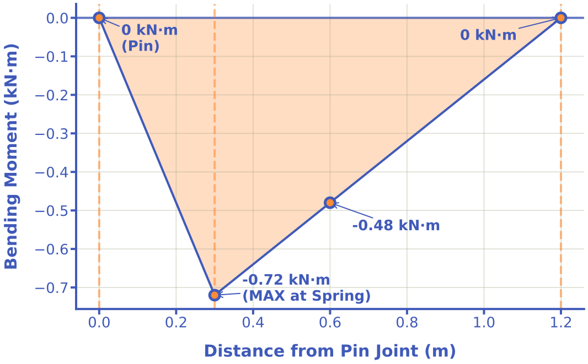

import MechanicsOfMaterialsComments from '../../../../components/mechanics-of-materials/MechanicsOfMaterialsComments.astro';
import TawkWidget from '../../../../components/TawkWidget.astro';
import UniversalContentContributors from '../../../../components/UniversalContentContributors.astro';
import InArticleAd from '../../../../components/InArticleAd.astro';
import Copyright from '../../../../components/Copyright.astro';
import BionicText from '../../../../components/BionicText.astro';
import TailwindWrapper from '../../../../components/TailwindWrapper.jsx';
import { Tabs, TabItem } from '@astrojs/starlight/components';
import { Card, CardGrid, Badge, Steps, LinkButton } from '@astrojs/starlight/components';

<UniversalContentContributors 
  contributors={frontmatter.contributors}
/>

import ChartEmbed from '../../../../components/mechanics-of-materials/ChartEmbed.astro';
import LoadingDiagramEmbed from '../../../../components/mechanics-of-materials/LoadingDiagramEmbed.astro';

Master bending stress analysis through practical engineering applications, covering the flexural formula, neutral axis concepts, stress distribution, and design for multiple beam configurations under various loading conditions. #FlexuralFormula #BeamAnalysis #StructuralDesign

## 🎯 Learning Objectives

By the end of this lesson, you will be able to:
1. <Badge text="Calculate" variant="tip" /> bending stresses in beams using the flexural formula for various loading conditions
2. <Badge text="Locate" variant="note" /> the neutral axis and identify maximum stress locations in beam cross-sections
3. <Badge text="Analyze" variant="caution" /> stress distribution and shear/moment diagrams for different beam types
4. <Badge text="Design" variant="tip" /> structural members for both tensile and compressive stress limits in real-world applications

## 🔧 Engineering Beams: The Foundation of Structural Design

<InArticleAd />

  <TailwindWrapper>
	
  </TailwindWrapper>

<BionicText method="advanced" intensity="medium" class="highlight">
Beams are fundamental structural elements found in virtually every engineering system—from electric train pantographs and crane jibs to 3D printer gantries and structural frameworks. Understanding bending stresses is essential for designing safe, efficient structures that can withstand operational loads without failure.
</BionicText>

### The Universal Bending Challenge

Regardless of the application, engineers must address:

:::note[Critical Design Considerations]
- **Loading conditions**: Concentrated forces, distributed loads, and combinations
- **Support reactions**: Calculating forces at support points
- **Internal forces**: Shear forces and bending moments throughout the beam
- **Stress distribution**: Tension and compression across cross-sections
- **Material limits**: Ensuring stresses remain within allowable limits
:::

> **Engineering Question:** How do we calculate bending stresses in various beam configurations and ensure structural members can safely carry their intended loads?

#### Why Bending Stress Analysis Matters
**Consequences of Inadequate Bending Analysis:**
- **Structural failure** due to stress exceeding material strength
- **Excessive deflection** affecting functionality and aesthetics
- **Fatigue failure** from repeated loading cycles
- **Over-design** leading to unnecessary material costs and weight

**Benefits of Proper Bending Analysis:**
- **Safe, reliable structures** designed for actual loading conditions
- **Optimized cross-sections** balancing strength, weight, and cost
- **Predictable performance** under service loads
- **Extended service life** through proper stress management
- **Informed material selection** based on stress requirements

## 📚 Fundamental Theory: Bending Stress Mechanics

### The Flexural Formula

When a beam bends under load, internal stresses develop to resist the applied moment:

<Card title="🎯 Flexural Formula - Bending Stress" icon="document">
$$\sigma = \frac{My}{I}$$

**Where:**
- $\sigma$ = Bending stress at distance y from neutral axis (Pa)
- $M$ = Bending moment at the section (N·m)
- $y$ = Distance from neutral axis to the point of interest (m)
- $I$ = Second moment of area about the neutral axis (m⁴)

**Physical Meaning:** Bending stress varies linearly across the beam cross-section, with maximum stress at the extreme fibers and zero stress at the neutral axis.
</Card>

### Neutral Axis and Stress Distribution

<Tabs>
  <TabItem label="Neutral Axis Location">
    
    **For symmetric cross-sections:**
    - The neutral axis passes through the **centroid**
    - **Zero stress** at the neutral axis
    - **Maximum stress** at the extreme fibers
    
    **Stress varies linearly** with distance from neutral axis
    
  </TabItem>
  <TabItem label="Maximum Stress">
    
    <Card title="⚡ Maximum Bending Stress" icon="document">
    $$\sigma_{max} = \frac{M \cdot c}{I} = \frac{M}{S}$$
    
    **Where:**
    - $c$ = distance from neutral axis to extreme fiber (m)
    - $S = \frac{I}{c}$ = section modulus (m³)
    
    **Physical Meaning:** Section modulus combines geometric properties (I and c) into a single parameter for maximum stress calculation.
    </Card>

    
  </TabItem>
  <TabItem label="Sign Convention">
    
    **Positive Bending Moment:**
    - **Compression** on top fiber
    - **Tension** on bottom fiber
    - Beam curves upward (smile shape)
    
    **Material Failure Modes:**
    - Tension failure (brittle materials)
    - Compression failure (slender sections)
    
  </TabItem>
</Tabs>

### Second Moment of Area for Common Shapes

**Rectangular Section (width b, height h):**
$$I = \frac{bh^3}{12}$$

**Circular Section (diameter d):**
$$I = \frac{\pi d^4}{64}$$

:::tip[Design Insight]
For the same cross-sectional area, **tall narrow sections** have much higher bending resistance than **short wide sections**. This is why I-beams and T-beams are so effective in bending.
:::

## 🏭 Application 1: Pantograph Arm of Electric Train (Electromechanical)

<InArticleAd />

An electric train pantograph arm maintains contact with overhead power lines through a spring-loaded mechanism. Real pantographs use a **pin joint at the base** with **spring forces** to provide the upward contact pressure, allowing the arm to articulate and adapt to varying wire heights.

:::note[System Problem Statement]
- **Support configuration:** Pin joint at A (single support, allows rotation, provides vertical reaction only)
- **Loading conditions:** Downward point load P1 at wire contact + Upward point load F_spring at spring location (P2)

  <TailwindWrapper>
    
  </TailwindWrapper>

**What we need to analyze:**
1. **Spring force** required to maintain wire contact
2. **Support reaction forces** at the pin joint
3. **Shear force and bending moment diagrams** for the articulated beam
4. **Maximum bending stress** at the critical section (spring location)
5. **Safety factor assessment** against yield failure

**Key Question:** Where does maximum bending stress occur in this pin-supported beam with spring loading, and does the design provide adequate safety margin for dynamic railway operations?
:::

<Card title="🔧 Equivalent System Model" icon="document">

  <TailwindWrapper>
	
  </TailwindWrapper>

**Geometric Configuration:**
- Hollow steel tube: Outer Diameter (OD) = 50 mm, wall thickness = 4 mm
- Total arm length: L = 1200 mm from pin joint A to contact point P1
- Spring location P2: 300 mm from pin joint A

**Loading Conditions:**
- Wire contact force: P1 = 800 N downward at tip (reaction from overhead cable)
- Spring force: F_spring (P2) = ? (to be determined from equilibrium)

**Cross-Section Properties:**
- Second moment of area: I = 2.45 × 10⁶ mm⁴
- Distance to extreme fiber: c = 25 mm
- Section modulus: S = I/c = 98,000 mm³

**Material & Safety:**
- Material: High-strength steel (σ_yield = 250 MPa)
- Safety factor required: 3.0
- Operating conditions: Dynamic contact with overhead wire at 600V DC
</Card>

### Step 1: Calculate Spring Force and Support Reactions

**Click to reveal equilibrium calculations**

<Steps>

1. **Identify loading and support configuration:**

   **Pin joint at A** (x = 0): Provides vertical reaction R_A only (no moment resistance!)

   **Spring mechanism** at x = 300 mm: Provides upward force F_spring

   **Wire contact** at P₁ (x = 1200 mm): Downward reaction force = 800 N

2. **Calculate required spring force using moment equilibrium about pin A:**

   $\sum M_A = 0$ (pin joint cannot resist moment)

   Taking counterclockwise moments as positive:

   $F_{spring} \times 300 - P_1 \times 1200 = 0$

   $F_{spring} = \frac{800 \times 1200}{300} = \frac{960,000}{300} = 3200 \text{ N}$ ✅

   **Physical meaning:** Spring must provide 4× the contact force due to 4:1 lever arm ratio (1200/300)

3. **Calculate pin reaction using vertical force equilibrium:**

   $\sum F_y = 0$

   $R_A + F_{spring} - P_1 = 0$

   $R_A = P_1 - F_{spring} = 800 - 3200 = -2400 \text{ N}$

   **Negative sign means R_A acts downward** (pin pulls down on the arm) ✅

4. **Verify equilibrium:**

   - **Vertical forces:** $-2400 + 3200 - 800 = 0$ ✅
   - **Moments about A:** $3200(0.3) - 800(1.2) = 960 - 960 = 0$ ✅

5. **Key insight - comparison with fixed cantilever:**

   **Fixed cantilever** (incorrect model): Maximum moment (M = 960 N·m) at support A

   **Pin + Spring** (correct model): **No moment at A** (pin cannot resist moment). Maximum moment will occur **at the spring location** where internal forces change!

</Steps>

### Step 2: Shear Force Analysis

**Click to reveal shear calculations at critical points**

<Steps>
1. **Region 1: Pin joint to spring (0 ≤ x < 0.3 m):**

   Applying force equilibrium on a section between pin and spring:

   $V = R_A = -2400 \text{ N}$

   - Negative indicates downward internal shear force
   - No applied loads in this region, so V remains constant ✅

2. **Region 2: Spring to wire contact (0.3 m < x ≤ 1.2 m):**

   After passing the spring, the upward spring force adds to the reaction:

   $V = R_A + F_{spring} = -2400 + 3200 = +800 \text{ N}$

   - Positive indicates upward internal shear force
   - Remains constant until the wire contact point
   - At wire contact (x = 1.2 m), the 800 N downward force brings V back to zero ✅

3. **Shear force jump at spring location (x = 0.3 m):**

   - Just before spring: $V = -2400 \text{ N}$
   - Just after spring: $V = +800 \text{ N}$
   - **Jump magnitude:** $\Delta V = 3200 \text{ N}$ (equals spring force) ✅

4. **Verify shear at wire contact:**

   At x = 1.2 m (after wire contact): $V = 800 - 800 = 0 \text{ N}$ ✅

</Steps>

**Shear Force Diagram**

  <TailwindWrapper>
	
  </TailwindWrapper>

> **Key observations:**
> **Two-region shear distribution**: V = -2400 N from pin to spring, then V = +800 N from spring to wire
> **Discontinuity at spring**: 3200 N upward jump where spring force is applied
> **Unlike fixed cantilever**: Shear is NOT constant—changes sign at spring location

### Step 3: Bending Moment Analysis

**Click to reveal moment calculations at critical points**

- **Method:** Cut the beam at position x, sum moments of forces to the LEFT of the cut

<Steps>
1. **At pin joint (x = 0):**

   Forces to the left: None (starting point)

   $M = 0 \text{ N·m}$

   **Key insight:** Pin joint cannot resist moment! ✅

2. **Region 1 (0 < x < 0.3 m): Pin to spring**

   Forces to the left: R_A only

   $M(x) = R_A \times x = -2400x$ (in N·m when x in meters)

   - Linear increase in negative moment
   - At x = 0.3 m (spring location): $M = -2400(0.3) = -720 \text{ N·m}$ ✅

3. **Region 2 (0.3 m < x < 1.2 m): Spring to wire**

   Forces to the left: R_A and F_spring

   $M(x) = R_A \times x + F_{spring} \times (x - 0.3)$

   $M(x) = -2400x + 3200(x - 0.3) = -2400x + 3200x - 960 = 800x - 960$ (N·m)

   - At x = 0.3 m: $M = 800(0.3) - 960 = -720 \text{ N·m}$ (continuous at spring)
   - At x = 0.6 m (midspan): $M = 800(0.6) - 960 = -480 \text{ N·m}$
   - At x = 0.9 m: $M = 800(0.9) - 960 = -240 \text{ N·m}$
   - At x = 1.2 m (wire contact): $M = 800(1.2) - 960 = 0 \text{ N·m}$ ✅

4. **Verify moment equilibrium:**

   At wire contact (x = 1.2 m), moment should equal zero (free end condition):

   $M = R_A(1.2) + F_{spring}(1.2 - 0.3) - P_1(0) = -2400(1.2) + 3200(0.9) = -2880 + 2880 = 0$ ✅

</Steps>

> **Critical observation:** Negative moments throughout indicate **tension on top fiber** and **compression on bottom fiber**. The beam curves downward (pantograph arm droops under wire contact force).

**Bending Moment Diagram**

  <TailwindWrapper>
	
  </TailwindWrapper>

**Key observations:**
- **Region 1 (0 to 0.3m):** M(x) = -2400x (steep negative slope)
- **Region 2 (0.3m to 1.2m):** M(x) = 800x - 960 (gentler positive slope)
- **Maximum moment magnitude:** |M_max| = 720 N·m at spring location (x = 0.3 m)
- **Critical design location:** Spring attachment point experiences highest bending stress

### Step 4: Calculate Maximum Bending Stress

**Click to reveal stress calculations**

<Steps>

1. **Apply flexural formula at critical section (spring location):**

   $$\sigma_{max} = \frac{M \cdot c}{I} = \frac{720,000 \times 25}{2.45 \times 10^6} = \frac{18,000,000}{2,450,000} = 7.35 \text{ MPa}$$

2. **Alternative using section modulus:**

   $$S = \frac{I}{c} = \frac{2.45 \times 10^6}{25} = 98,000 \text{ mm}^3$$

   $$\sigma_{max} = \frac{M}{S} = \frac{720,000}{98,000} = 7.35 \text{ MPa}$$ ✅

3. **Stress distribution at spring attachment (x = 0.3 m):**

   - Maximum tensile stress: +7.35 MPa (top fiber)
   - Maximum compressive stress: -7.35 MPa (bottom fiber)
   - Neutral axis stress: 0 MPa ✅

</Steps>

### Step 5: Safety Factor Assessment

**Click to reveal safety calculations**

<Steps>

1. **Calculate actual safety factor:**

   $$SF_{actual} = \frac{\sigma_{yield}}{\sigma_{max}} = \frac{250}{7.35} = 34.0$$

2. **Compare with required safety factor:**

   Required SF = 3.0
   Actual SF = 34.0 >> 3.0 ✅

3. **Design adequacy assessment:**

   The pantograph arm is **significantly over-designed** with respect to static bending stress.

   This high safety margin (>10× required) is intentional for several reasons:
   - **Dynamic loading:** Sudden wire contact/loss creates impact forces
   - **Vibration effects:** Train motion causes cyclic loading
   - **Fatigue resistance:** Millions of contact cycles over service life
   - **Electrical safety:** Must not fail near high-voltage overhead wire
   - **Wear tolerance:** Spring force increases as contacts wear ✅

</Steps>

### Step 6: Dynamic Loading and Failure Risk Analysis

**Click to reveal dynamic analysis**

<Steps>

1. **Dynamic amplification considerations:**

   Current analysis uses static load of 800 N which already includes vibration effects.

   Actual contact force may vary: 200-1200 N depending on wire tension and vehicle dynamics. ✅

2. **Sudden contact loss scenarios:**

   **Risk 1: Rapid load removal (dewirement)**
   - Stored elastic energy in beam suddenly released
   - Spring force causes violent upward motion if not damped
   - Can damage overhead wire or contact strip
   - Damping mechanisms essential for controlled motion ✅

   **Risk 2: Recontact impact**
   - Higher impact forces during wire recontact
   - May exceed static analysis by 2-4× due to dynamic effects
   - Still within safety margin: 4 × 7.35 = 29.4 MPa $\ll$ 250 MPa (SF = 8.5 even with 4× dynamic amplification) ✅

3. **Fatigue considerations:**

   Continuous contact/loss cycles create fatigue loading:
   - Typical train: 10,000+ contact cycles per day
   - Over 20-year service life: ~70 million cycles
   - Endurance limit for steel: ~125 MPa (50% of yield for high-cycle fatigue)
   - Maximum stress (7.35 MPa) is far below endurance limit
   - High safety factor (SF = 34) provides adequate fatigue life margin ✅

</Steps>

## 🏭 Application 2: Crane Jib with Overhang Loading (Mechanical)

<InArticleAd />

An industrial crane jib beam supports a hoist mechanism with multiple load points typical in material handling systems. This analysis demonstrates complex loading scenarios with both positive and negative bending moments.

:::note[System Problem Statement]
- **Loading condition:** Uniformly distributed load (UDL) + two point loads
- **Support configuration:** Overhanging simply supported beam with roller

  <TailwindWrapper>
	
  </TailwindWrapper>

**What we need to analyze:**
1. **Support reaction forces** under combined loading
2. **Shear force and bending moment diagrams** across the entire beam
3. **Maximum bending stress** and its critical location
4. **Safety factor assessment** for structural adequacy

**Key Question:** Can this crane jib safely handle the specified loads including dynamic factors, and where do the maximum stresses occur?
:::

<Card title="🔧 Equivalent System Model" icon="document">

  <TailwindWrapper>
	
  </TailwindWrapper>

**Given:**
- Steel I-beam: 150 mm × 100 mm × 8 mm (I = 8.2 × 10⁶ mm⁴, c = 75 mm)
- Span: 3000 mm between supports A and B
- Overhang: 1000 mm beyond support B
- Load 1: P₁ = 5000 N at 1500 mm from A (midspan)
- Load 2: P₂ = 3000 N at end of overhang
- Load 3: Distributed load W = 800 N/m over entire length (beam self-weight + attachments)
- Material: Structural steel (σ_yield = 250 MPa)
- Safety factor required: 2.5
- Dynamic amplification factor: 1.4 (for crane operations)
</Card>

### Step 1: Calculate Support Reaction Forces

**Click to reveal equilibrium calculations**

<Steps>

1. **Account for distributed loading effects:**

   Distributed load total force: W = w × L_total = 800 × 4.0 = 3200 N

   This acts at the centroid of the beam: x̄ = 2.0 m from A ✅

2. **Apply dynamic amplification factor:**

   Applied loads with dynamic effects:
   - P₁_dynamic = 1.4 × 5000 = 7000 N
   - P₂_dynamic = 1.4 × 3000 = 4200 N
   - W remains at 3200 N (self-weight not amplified) ✅

3. **Calculate reaction at support B using moment equilibrium about A:**

   $$\sum M_A = 0: R_B(3.0) - 7000(1.5) - 3200(2.0) - 4200(4.0) = 0$$
   $$R_B = \frac{10500 + 6400 + 16800}{3.0} = \frac{33700}{3.0} = 11233 \text{ N}$$ ✅

4. **Calculate reaction at support A using force equilibrium:**

   $$\sum F_y = 0: R_A + 11233 - 7000 - 3200 - 4200 = 0$$
   $$R_A = 14400 - 11233 = 3167 \text{ N}$$ ✅

5. **Verify equilibrium check:**

   $$\sum F_y = 3167 + 11233 - 7000 - 3200 - 4200 = 0$$ ✅

</Steps>

### Step 2: Shear Force Analysis

**Click to reveal shear force analysis at critical points**

<Steps>
1. At x = 0 (point A): V = +3167 N
2. Just before P₁ (x = 1.5⁻): V = 3167 - 800(1.5) = 1967 N

   Just after P₁ (x = 1.5⁺): V = 1967 - 7000 = -5033 N ✅
   
3. Just before B (x = 3.0⁻): V = -5033 - 800(1.5) = -6233 N

   Just after B (x = 3.0⁺): V = -6233 + 11233 = 5000 N ✅
   
4. At overhang end (x = 4.0): V = 5000 - 800(1.0) - 4200 = 0 ✅
</Steps>

  <TailwindWrapper>
	
  </TailwindWrapper>

### Step 3: Bending Moment Analysis

**Click to reveal bending moment analysis at critical points**

- **Method:** Cut beam at calculation point, sum moments of all forces to the LEFT of the cut
<Steps>
1. **At support A (x = 0 m):**

   Forces to the left: None (this is the starting point)

   $$M = 0 \text{ N·m}$$ ✅

2. **At midspan (x = 1.5 m):**

   Forces to the left: R_A and partial distributed load
   - R_A = 3167 N at distance 1.5 m from cut
   - Distributed load from 0 to 1.5 m = 800(1.5) = 1200 N at centroid distance 0.75 m from cut

   $$M = 3167(1.5) - 1200(0.75) = 4750.5 - 900 = 3850.5 \text{ N·m}$$ ✅

3. **At support B (x = 3.0 m):**

   Forces to the left: R_A, distributed load from 0 to 3.0 m, and P₁

   - R_A = 3167 N at distance 3.0 m from cut
   - Distributed load from 0 to 3.0 m = 800(3.0) = 2400 N at centroid distance 1.5 m from cut
   - P₁ = 7000 N at distance (3.0 - 1.5) = 1.5 m from cut

   $$M = 3167(3.0) - 2400(1.5) - 7000(1.5) = 9501 - 3600 - 10500 = -4599 \text{ N·m}$$ ✅

4. **At overhang end (x = 4.0 m):**

   Forces to the left: R_A, full distributed load, P₁, and R_B
   - R_A = 3167 N at distance 4.0 m from cut
   - Full distributed load = 800(4.0) = 3200 N at centroid distance 2.0 m from cut
   - P₁ = 7000 N at distance (4.0 - 1.5) = 2.5 m from cut
   - R_B = 11233 N at distance (4.0 - 3.0) = 1.0 m from cut
   - P₂ = 4200 N at distance (4.0 - 4.0) = 0 m from cut

   $$M = 3167(4.0) - 3200(2.0) - 7000(2.5) + 11233(1.0) - 4200(0)$$
   $$M = 12668 - 6400 - 17500 + 11233 - 0 = 1 \text{ N·m} \approx 0$$ ✅
</Steps>
> **Note:** The moment at the free end is approximately zero, confirming equilibrium.

  <TailwindWrapper>
	
  </TailwindWrapper>

<Steps>
3. **Identify maximum moment locations:**

   - **Positive moment maximum:** M = +3850.5 N·m at x = 1.5 m
   - **Negative moment maximum:** M = -4599 N·m at support B (x = 3.0 m) ✅
</Steps>

### Step 4: Calculate Maximum Bending Stresses

**Click to reveal stress calculations**

<Steps>

1. **Calculate section modulus using flexural formula:**

   **Flexural Formula:** $$\sigma = \frac{My}{I}$$

   **For maximum stress:** $$\sigma_{max} = \frac{M \cdot c}{I}$$

   **Section Modulus:** $$S = \frac{I}{c}$$

   **Therefore:** $$\sigma_{max} = \frac{M}{S}$$

   Given I = 8.2 × 10⁶ mm⁴ and c = 75 mm:
   $$S = \frac{I}{c} = \frac{8.2 \times 10^6}{75} = 109333 \text{ mm}^3 = 109.33 \times 10^{-6} \text{ m}^3$$ ✅

2. **Calculate stress at positive moment maximum (x = 1.5 m):**

   $$\sigma_{max,pos} = \frac{M_{max,pos}}{S} = \frac{3850.5}{109.33 \times 10^{-6}} = 35.2 \text{ MPa}$$ ✅

   **Stress distribution:** Compression on top fiber, tension on bottom fiber

3. **Calculate stress at negative moment maximum (x = 3.0 m):**

   $$\sigma_{max,neg} = \frac{|M_{max,neg}|}{S} = \frac{4599}{109.33 \times 10^{-6}} = 42.1 \text{ MPa}$$ ✅

   **Stress distribution:** Tension on top fiber, compression on bottom fiber

4. **Determine controlling stress:**

   Comparing the two maximum stresses:
   - Positive moment stress: 35.2 MPa
   - Negative moment stress: 42.1 MPa

   **Maximum bending stress** = 42.1 MPa occurs at support B ✅

</Steps>

### Step 5: Safety Factor Assessment and Design Verification

**Click to reveal safety analysis**

<Steps>

1. **Calculate safety factor against yielding:**

   $$SF_{yield} = \frac{\sigma_{yield}}{\sigma_{max}} = \frac{250}{42.1} = 5.94$$ ✅

2. **Check against required safety factor:**

   **Design Criterion:** If the required safety factor is 2.5, then your design safety factor must be ≥ 2.5

   Required SF = 2.5, Actual SF = 5.94 > 2.5 ✅

   **Design Status:** ADEQUATE with substantial margin

3. **Assess critical design considerations:**

   - **Support B region** experiences highest stress (42.1 MPa)
   - **Negative bending** creates tension on top flange at support B
   - **Dynamic loading** significantly increases applied loads (40% amplification applied) ✅
   - **Design is conservative** with SF = 5.94, well above required SF = 2.5

</Steps>

## 🏭 Application 3: 3D Printer Gantry Rail (Mechatronics)

A 3D printer gantry rail supports a moving print head assembly that traverses the build platform. The rail experiences a concentrated load as the print head moves to different positions during printing. We need to determine which position creates the worst-case bending stress.

:::note[System Problem Statement]
- **Support configuration:** Simply supported beam at both ends (allows rotation, provides vertical reactions)
- **Loading conditions:** Point load from print head assembly at three critical positions along the beam

  <TailwindWrapper>
    
  </TailwindWrapper>

**What we need to analyze:**
1. **Support reaction forces** at three print head positions: left quarter-point, midspan, and right quarter-point
2. **Bending moment** at each load position
3. **Maximum bending stress** by comparing all three cases
4. **Safety factor assessment** against yield failure

**Key Question:** Which print head position creates the maximum bending stress in the gantry rail, and is the design safe under normal operating conditions?
:::

<Card title="🔧 Equivalent System Model" icon="document">

  <TailwindWrapper>
	
  </TailwindWrapper>

**Geometric Configuration:**
- Aluminum extrusion beam: Span L = 1200 mm between supports
- Support A at x = 0 mm (left end)
- Support B at x = 1200 mm (right end)

**Loading Positions to Analyze:**
- Print head weight: P = 250 N (includes extruder, hotend, cooling fans)
- **Position 1:** Left quarter-point (x = 300 mm from support A)
- **Position 2:** Midspan (x = 600 mm from support A)
- **Position 3:** Right quarter-point (x = 900 mm from support A)

**Cross-Section Properties:**
- Second moment of area: I = 2.2 × 10⁶ mm⁴
- Distance to extreme fiber: c = 25 mm
- Section modulus: S = I/c = 88,000 mm³

**Material & Safety:**
- Material: Aluminum 6061-T6 (σ_yield = 275 MPa, E = 69 GPa)
- Safety factor required: 3.0

</Card>

### Step 1: Calculate Support Reactions at Three Load Positions

**Click to reveal support reaction calculations**

We'll analyze the beam with the print head at three different positions and calculate the support reactions for each case.

**General formulas for simply supported beam with point load at distance 'x' from left support:**

$$R_B = \frac{P \cdot x}{L} \quad \text{and} \quad R_A = \frac{P(L-x)}{L}$$

<Steps>

1. **Position 1: Print head at left quarter-point (x = 300 mm)**

   **Calculate R_B using moment equilibrium about A:**

   $\sum M_A = 0$ (taking moments about A)

   $R_B \times 1200 - 250 \times 300 = 0$

   $R_B = \frac{250 \times 300}{1200} = \frac{75,000}{1200} = 62.5$ N ✅

   **Calculate R_A using vertical force equilibrium:**

   $\sum F_y = 0$

   $R_A + R_B - 250 = 0$

   $R_A = 250 - 62.5 = 187.5$ N ✅

   **Verify:** $R_A + R_B = 187.5 + 62.5 = 250$ N ✅

2. **Position 2: Print head at midspan (x = 600 mm)**

   **Calculate R_B:**

   $R_B = \frac{250 \times 600}{1200} = \frac{150,000}{1200} = 125$ N ✅

   **Calculate R_A:**

   $R_A = 250 - 125 = 125$ N ✅

   **Note:** At midspan, both supports share the load equally ✅

3. **Position 3: Print head at right quarter-point (x = 900 mm)**

   **Calculate R_B:**

   $R_B = \frac{250 \times 900}{1200} = \frac{225,000}{1200} = 187.5$ N ✅

   **Calculate R_A:**

   $R_A = 250 - 187.5 = 62.5$ N ✅

   **Observation:** Notice the symmetry - reactions at Position 1 and Position 3 are mirror images ✅

4. **Summary of reactions:**

   | Position | Distance x | R_A (N) | R_B (N) |
   |----------|-----------|---------|---------|
   | Left quarter | 300 mm | 187.5 | 62.5 |
   | Midspan | 600 mm | 125.0 | 125.0 |
   | Right quarter | 900 mm | 62.5 | 187.5 |

</Steps>

### Step 2: Calculate Maximum Bending Moment at Each Position

**Click to reveal bending moment calculations**

For a simply supported beam with a point load, the maximum moment occurs **directly under the load** at the load position.

**General formula:** $M_{max} = \frac{P \cdot x \cdot (L-x)}{L}$

<Steps>

1. **Position 1: Load at left quarter-point (x = 300 mm)**

   Maximum moment occurs at x = 300 mm (where the load is):

   $M_{max} = \frac{P \cdot x \cdot (L-x)}{L} = \frac{250 \times 300 \times (1200-300)}{1200}$

   $M_{max} = \frac{250 \times 300 \times 900}{1200} = \frac{67,500,000}{1200}$

   $M_{max} = 56,250$ N·mm = **56.25 N·m** ✅

2. **Position 2: Load at midspan (x = 600 mm)**

   Maximum moment occurs at x = 600 mm (where the load is):

   $M_{max} = \frac{250 \times 600 \times (1200-600)}{1200}$

   $M_{max} = \frac{250 \times 600 \times 600}{1200} = \frac{90,000,000}{1200}$

   $M_{max} = 75,000$ N·mm = **75.0 N·m** ✅

3. **Position 3: Load at right quarter-point (x = 900 mm)**

   Maximum moment occurs at x = 900 mm (where the load is):

   $M_{max} = \frac{250 \times 900 \times (1200-900)}{1200}$

   $M_{max} = \frac{250 \times 900 \times 300}{1200} = \frac{67,500,000}{1200}$

   $M_{max} = 56,250$ N·mm = **56.25 N·m** ✅

4. **Summary and comparison:**

   | Position | Distance x | Maximum Moment M_max |
   |----------|-----------|---------------------|
   | Left quarter | 300 mm | 56.25 N·m |
   | **Midspan** | **600 mm** | **75.0 N·m** ⭐ |
   | Right quarter | 900 mm | 56.25 N·m |

   **Key Observations:**
   - ⭐ **Maximum moment occurs at midspan** (x = 600 mm)
   - Symmetry: Quarter-point positions give identical moments
   - Midspan moment is 33% higher than quarter-point moments
   - This confirms midspan is the **worst-case position** for bending stress

</Steps>

**Bending Moment Diagram for midspan position (worst case):**

  <TailwindWrapper>
	
  </TailwindWrapper>

### Step 3: Calculate Bending Stress at Each Position

**Click to reveal stress calculations**

Now we'll use the flexural formula to calculate the bending stress for each load position.

**Flexural formula:** $\sigma_{max} = \frac{M \cdot c}{I}$ or $\sigma_{max} = \frac{M}{S}$ where $S = \frac{I}{c}$

**Given:** I = 2.2 × 10⁶ mm⁴, c = 25 mm, S = 88,000 mm³

<Steps>

1. **Position 1: Left quarter-point (M = 56,250 N·mm)**

   $$\sigma = \frac{M}{S} = \frac{56,250}{88,000} = 0.639 \text{ MPa}$$

   **Stress distribution:**
   - Bottom fiber (tension): +0.639 MPa
   - Top fiber (compression): -0.639 MPa ✅

2. **Position 2: Midspan (M = 75,000 N·mm)**

   $$\sigma = \frac{M}{S} = \frac{75,000}{88,000} = 0.852 \text{ MPa}$$

   **Stress distribution:**
   - Bottom fiber (tension): +0.852 MPa
   - Top fiber (compression): -0.852 MPa ✅

3. **Position 3: Right quarter-point (M = 56,250 N·mm)**

   $$\sigma = \frac{M}{S} = \frac{56,250}{88,000} = 0.639 \text{ MPa}$$

   **Stress distribution:**
   - Bottom fiber (tension): +0.639 MPa
   - Top fiber (compression): -0.639 MPa ✅

4. **Summary and worst-case identification:**

   | Position | Maximum Moment | Maximum Stress |
   |----------|---------------|----------------|
   | Left quarter | 56.25 N·m | 0.639 MPa |
   | **Midspan** | **75.0 N·m** | **0.852 MPa** ⭐ |
   | Right quarter | 56.25 N·m | 0.639 MPa |

   **Conclusion:** Maximum bending stress occurs when the print head is at **midspan**: σ_max = **0.852 MPa**

</Steps>

### Step 4: Safety Factor Assessment

**Click to reveal safety analysis**

<Steps>

1. **Calculate actual safety factor at worst case (midspan):**

   $$SF = \frac{\sigma_{yield}}{\sigma_{max}} = \frac{275 \text{ MPa}}{0.852 \text{ MPa}} = 323$$

2. **Compare with required safety factor:**

   - Required SF: 3.0
   - Actual SF: 323
   - **Result:** 323 >> 3.0 ✅ **Design is SAFE**

3. **Design adequacy assessment:**

   The gantry rail has an **extremely high safety factor** (>100× required).

   **Why such a large safety margin?**
   - ✅ **Stiffness, not strength, controls the design** - the beam must be rigid enough to prevent deflection that affects print quality
   - ✅ **Dynamic loads** - print head acceleration/deceleration creates additional forces
   - ✅ **Vibration control** - high stiffness prevents resonance and vibration during printing
   - ✅ **Long-term reliability** - aluminum experiences fatigue under repeated cyclic loading

4. **Quick deflection check (stiffness verification):**

   Maximum deflection at midspan:

   $$\delta_{max} = \frac{PL^3}{48EI} = \frac{250 \times (1200)^3}{48 \times 69,000 \times 2.2 \times 10^6} = 0.059 \text{ mm}$$

   **For precision 3D printing:**
   - Typical acceptable deflection: < 0.1 mm
   - Calculated deflection: 0.059 mm ✅
   - **Stiffness requirement is satisfied**

   **Conclusion:** The large cross-section is needed for **stiffness (deflection control)**, not strength. Bending stress is very low compared to material strength.

</Steps>

---

## 📋 Summary and Next Steps

In this lesson, you learned to:

1. **Apply** the flexural formula σ = My/I for bending stress calculation
2. **Identify** neutral axis location and stress distribution patterns  
3. **Calculate** section properties for common cross-sections
4. **Design** beams to meet both strength and safety factor requirements

**Key Design Insights:**
- <Badge text="Maximum stress occurs at extreme fibers" variant="tip" />
- <Badge text="Section modulus S = I/c determines bending capacity" variant="note" />
- <Badge text="Tall sections are much more efficient in bending" variant="tip" />

**Critical Formula:** $\sigma_{max} = \frac{M}{S} = \frac{My}{I}$

**Coming Next**: In Lesson 2.3, we'll analyze beam deflections and stiffness, exploring how to calculate elastic deformations in CNC spindles under cutting loads for precision control applications.

<InArticleAd />
<MechanicsOfMaterialsComments />
<TawkWidget />
<Copyright />
