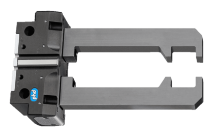

import MechanicsOfMaterialsComments from '../../../../components/mechanics-of-materials/MechanicsOfMaterialsComments.astro';
import TawkWidget from '../../../../components/TawkWidget.astro';
import UniversalContentContributors from '../../../../components/UniversalContentContributors.astro';
import Copyright from '../../../../components/Copyright.astro';
import BionicText from '../../../../components/BionicText.astro';
import TailwindWrapper from '../../../../components/TailwindWrapper.jsx';
import { Tabs, TabItem } from '@astrojs/starlight/components';
import { Card, CardGrid, Badge, Steps, LinkButton } from '@astrojs/starlight/components';

<UniversalContentContributors 
  contributors={frontmatter.contributors}
/>

import ChartEmbed from '../../../../components/mechanics-of-materials/ChartEmbed.astro';
import LoadingDiagramEmbed from '../../../../components/mechanics-of-materials/LoadingDiagramEmbed.astro';

## 🎯 Learning Objectives

By the end of this lesson, you will be able to:

1. **Calculate** bending stresses in cantilever gripper jaws using the flexural formula
2. **Locate** the neutral axis and identify maximum stress locations
3. **Analyze** stress distribution across beam cross-sections
4. **Design** gripper jaws for both tensile and compressive stress limits

## 🔧 Real-World System Problem: Robotic Gripper Jaw

<BionicText method="advanced" intensity="medium" class="highlight">
Robotic grippers are critical components in automation systems, requiring precise force control and structural integrity. The cantilever robotic gripper jaw must withstand bending moments from gripping forces while maintaining accuracy and preventing failure during object manipulation.
</BionicText>

  <TailwindWrapper>
	
  </TailwindWrapper>

### System Description

**Robotic Gripper Components:**
- **Gripper Jaw** (cantilever beam with gripping surface)
- **Actuator Mechanism** (provides closing force)
- **Force Sensors** (measure gripping force)
- **Position Feedback** (ensures accurate positioning)
- **Base Mounting** (connects to robot arm)

### The Bending Challenge

During gripping operations, the cantilever jaw experiences:

:::note[Critical Loading Conditions]
- **Concentrated gripping forces** at the jaw tip
- **Distributed reaction forces** from object contact
- **Bending moments** that create tension and compression
- **Stress concentrations** at mounting points and contact surfaces
:::

> **Engineering Question:** How do we calculate the maximum bending stress in a gripper jaw and ensure it doesn't exceed the material's strength limits during maximum gripping force?

**Click to Reveal: Why Bending Stress Analysis Matters**

**Consequences of Poor Bending Design:**
- **Jaw failure** during heavy object manipulation
- **Plastic deformation** reducing gripping accuracy
- **Fatigue cracking** from repeated loading cycles
- **Insufficient grip force** due to excessive flexibility

**Benefits of Proper Bending Analysis:**
- **Reliable gripping** under maximum load conditions
- **Optimized jaw geometry** for strength and weight
- **Predictable deflections** for control system compensation
- **Extended service life** through proper stress management

## 📚 Fundamental Theory: Bending Stress Mechanics

### The Flexural Formula

When a beam bends under load, internal stresses develop to resist the applied moment:

<Card title="🎯 Flexural Formula - Bending Stress" icon="document">
$$\sigma = \frac{My}{I}$$

**Where:**
- $\sigma$ = Bending stress at distance y from neutral axis (Pa)
- $M$ = Bending moment at the section (N·m)
- $y$ = Distance from neutral axis to the point of interest (m)
- $I$ = Second moment of area about the neutral axis (m⁴)

**Physical Meaning:** Bending stress varies linearly across the beam cross-section, with maximum stress at the extreme fibers and zero stress at the neutral axis.
</Card>

### Neutral Axis and Stress Distribution

<Tabs>
  <TabItem label="Neutral Axis Location">
    
    **For symmetric cross-sections:**
    - The neutral axis passes through the **centroid**
    - **Zero stress** at the neutral axis
    - **Maximum stress** at the extreme fibers
    
    **Stress varies linearly** with distance from neutral axis
    
  </TabItem>
  <TabItem label="Maximum Stress">
    
    <Card title="⚡ Maximum Bending Stress" icon="document">
    $$\sigma_{max} = \frac{M \cdot c}{I} = \frac{M}{S}$$
    
    **Where:**
    - $c$ = distance from neutral axis to extreme fiber (m)
    - $S = \frac{I}{c}$ = section modulus (m³)
    
    **Physical Meaning:** Section modulus combines geometric properties (I and c) into a single parameter for maximum stress calculation.
    </Card>

    
  </TabItem>
  <TabItem label="Sign Convention">
    
    **Positive Bending Moment:**
    - **Compression** on top fiber
    - **Tension** on bottom fiber
    - Beam curves upward (smile shape)
    
    **Material Failure Modes:**
    - Tension failure (brittle materials)
    - Compression failure (slender sections)
    
  </TabItem>
</Tabs>

### Second Moment of Area for Common Shapes

**Rectangular Section (width b, height h):**
$$I = \frac{bh^3}{12}$$

**Circular Section (diameter d):**
$$I = \frac{\pi d^4}{64}$$

:::tip[Design Insight]
For the same cross-sectional area, **tall narrow sections** have much higher bending resistance than **short wide sections**. This is why I-beams and T-beams are so effective in bending.
:::

## 🔧 Application 1: Robotic Gripper Jaw Analysis

Let's analyze a realistic cantilever gripper jaw design step by step.

:::note[Problem Statement]
**Industrial Robotic Gripper Jaw Analysis**

**What we need to determine:**
1. **Maximum bending moment** in the cantilever gripper jaw
2. **Maximum bending stress** at the critical section
3. **Safety factor** against material failure
4. **Redesign requirements** if the current design is inadequate

**Key Question:** Can this gripper jaw safely handle the specified gripping force without exceeding material limits, and if not, what changes are needed?
:::

**System Parameters:**
- Industrial robotic gripper jaw (cantilever beam)
- Length: L = 80 mm (cantilever span)
- Cross-section: Rectangular 15 mm × 8 mm
- Material: Aluminum 6061-T6 (**`σ_yield`** = 270 MPa, E = 70 GPa)
- **`Safety factor`**: 3.0
- Gripping force: F = 500 N (concentrated at tip)
- Analysis focus: Maximum stress at fixed support

### Step 1: Calculate Maximum Bending Moment

**Click to reveal moment calculations**

<Steps>

1. **Identify critical section:**
   
   The maximum moment occurs at the **fixed support** for a cantilever beam.

2. **Calculate maximum moment:**
   
   $$M_{max} = F \times L = 500 \times 0.08 = 40 \text{ N·m}$$

3. **Verify using beam theory:**
   
   From shear force and moment diagrams, the moment increases linearly from 0 at the tip to maximum at the support. ✅

</Steps>

### Step 2: Calculate Section Properties

**Click to reveal calculations**

**Cross-sectional properties** for rectangular section (15 mm × 8 mm):

**Second moment of area:**
$$I = \frac{bh^3}{12} = \frac{15 \times 8^3}{12} = \frac{15 \times 512}{12} = 640 \text{ mm}^4 = 640 \times 10^{-12} \text{ m}^4$$

**Distance to extreme fiber:**
$$c = \frac{h}{2} = \frac{8}{2} = 4 \text{ mm} = 4 \times 10^{-3} \text{ m}$$

**Section modulus:**
$$S = \frac{I}{c} = \frac{640 \times 10^{-12}}{4 \times 10^{-3}} = 160 \times 10^{-9} \text{ m}^3$$

### Step 3: Calculate Maximum Bending Stress

**Click to reveal stress calculations**

<Steps>

1. **Apply flexural formula:**
   
   $$\sigma_{max} = \frac{M \cdot c}{I} = \frac{40 \times 4 \times 10^{-3}}{640 \times 10^{-12}} = 250 \times 10^6 \text{ Pa} = 250 \text{ MPa}$$

2. **Alternative using section modulus:**
   
   $$\sigma_{max} = \frac{M}{S} = \frac{40}{160 \times 10^{-9}} = 250 \text{ MPa}$$

3. **Check safety factor:**
   
   $$SF = \frac{\sigma_{yield}}{\sigma_{max}} = \frac{270}{250} = 1.08$$

</Steps>

:::caution[Design Assessment]
**Safety Factor = 1.08** is far below the required SF = 3.0!

The gripper jaw is **severely undersized** and likely to fail under the specified load.
:::

### Step 4: Redesign for Adequate Safety Factor

**Click to reveal redesign calculations**

<Steps>

1. **Required maximum stress with SF = 3.0:**
   
   $$\sigma_{allowable} = \frac{\sigma_{yield}}{SF} = \frac{270}{3.0} = 90 \text{ MPa}$$

2. **Required section modulus:**
   
   $$S_{required} = \frac{M}{\sigma_{allowable}} = \frac{40}{90 \times 10^6} = 444 \times 10^{-9} \text{ m}^3$$

3. **Calculate required height (width = 15 mm):**
   
   $$S = \frac{bh^2}{6} = \frac{15 \times h^2}{6} = 444 \times 10^{-9}$$
   $$h^2 = \frac{6 \times 444 \times 10^{-9}}{15 \times 10^{-3}} = 1.78 \times 10^{-4}$$
   $$h = 13.3 \text{ mm}$$
   
   **Design Decision:** Use **15 mm × 14 mm** cross-section for standard sizing.

</Steps>

## 🔧 Engineering Problems

### Problem 1: Servo Motor Shaft Under Load

A servo motor shaft in a robotic joint experiences bending moments due to gear reaction forces and load inertia.

**Given:**
- Solid circular shaft diameter: d = 25 mm
- Maximum bending moment: M = 180 N·m (at gear location)
- Material: Steel shaft (σ_yield = 300 MPa, E = 200 GPa)
- Safety factor required: 2.5

**Find:** Maximum bending stress and safety factor verification.

**Click to reveal solution**

<Steps>

1. ✓ **Calculate section properties**
   
   For solid circular cross-section:
   - Area: A = πd²/4 = π(25)²/4 = 491 mm²
   - Second moment of area: I = πd⁴/64 = π(25)⁴/64 = 19,175 mm⁴
   - Section modulus: S = I/c = I/(d/2) = 19,175/12.5 = 1,534 mm³

2. ✓ **Apply flexural formula**
   
   Maximum bending stress occurs at extreme fiber:
   σ_max = M/S = (180 × 10³)/1,534 = 117.3 MPa

3. ✓ **Check safety factor**
   
   SF = σ_yield/σ_max = 300/117.3 = 2.56
   Required SF = 2.5, Actual SF = 2.56 ✓

4. ✓ **Stress distribution analysis**
   
   - Maximum tensile stress: +117.3 MPa (bottom fiber)
   - Maximum compressive stress: -117.3 MPa (top fiber)
   - Neutral axis stress: 0 MPa

5. ✓ **Design verification**
   
   The 25 mm diameter shaft is adequate with SF = 2.56 > 2.5 required

</Steps>

## 🔧 Application 3: Crane Jib with Overhang Loading

An industrial crane jib beam supports a hoist mechanism with multiple load points typical in material handling systems. This analysis demonstrates complex loading scenarios with both positive and negative bending moments.

:::note[Problem Statement]

  <TailwindWrapper>
	
  </TailwindWrapper>

**What we need to determine:**
1. **Support reaction forces** under combined loading
2. **Shear force and bending moment diagrams** across the entire beam
3. **Maximum bending stress** and its critical location
4. **Safety factor assessment** for structural adequacy

**Key Question:** Can this crane jib safely handle the specified loads including dynamic factors, and where do the maximum stresses occur?
:::

**System Parameters:**
<LoadingDiagramEmbed
  src="/education/mechanics-of-materials/components/lesson-2-2/crane_jib_loading_diagram.html"
  title="Crane Jib Loading Diagram"
  description="Beam structure with loads and reactions"
  height="380px"
/>
- Steel I-beam: 150 mm × 100 mm × 8 mm (I = 8.2 × 10⁶ mm⁴, c = 75 mm)
- Span: 3000 mm between supports A and B
- Overhang: 1000 mm beyond support B
- Load 1: P₁ = 5000 N at 1500 mm from A (midspan)
- Load 2: P₂ = 3000 N at end of overhang
- Load 3: Distributed load w = 800 N/m over entire length (beam self-weight + attachments)
- Material: Structural steel (σ_yield = 250 MPa)
- Safety factor required: 2.5
- Dynamic amplification factor: 1.4 (for crane operations)

### Step 1: Calculate Support Reaction Forces

**Click to reveal equilibrium calculations**

<Steps>

1. **Account for distributed loading effects:**

   Distributed load total force: W = w × L_total = 800 × 4.0 = 3200 N

   This acts at the centroid of the beam: x̄ = 2.0 m from A ✅

2. **Apply dynamic amplification factor:**

   Applied loads with dynamic effects:
   - P₁_dynamic = 1.4 × 5000 = 7000 N
   - P₂_dynamic = 1.4 × 3000 = 4200 N
   - W remains at 3200 N (self-weight not amplified) ✅

3. **Calculate reaction at support B using moment equilibrium about A:**

   $$\sum M_A = 0: R_B(3.0) - 7000(1.5) - 3200(2.0) - 4200(4.0) = 0$$
   $$R_B = \frac{10500 + 6400 + 16800}{3.0} = \frac{33700}{3.0} = 11233 \text{ N}$$ ✅

4. **Calculate reaction at support A using force equilibrium:**

   $$\sum F_y = 0: R_A + 11233 - 7000 - 3200 - 4200 = 0$$
   $$R_A = 14400 - 11233 = 3167 \text{ N}$$ ✅

5. **Verify equilibrium check:**

   $$\sum F_y = 3167 + 11233 - 7000 - 3200 - 4200 = 0$$ ✅

</Steps>

### Step 2: Construct Shear Force and Bending Moment Diagrams

**Click to reveal shear and moment analysis**

- **Calculate shear forces at critical points:**
<Steps>
1. At x = 0 (point A): V = +3167 N
2. Just before P₁ (x = 1.5⁻): V = 3167 - 800(1.5) = 1967 N

   Just after P₁ (x = 1.5⁺): V = 1967 - 7000 = -5033 N ✅
   
3. Just before B (x = 3.0⁻): V = -5033 - 800(1.5) = -6233 N

   Just after B (x = 3.0⁺): V = -6233 + 11233 = 5000 N ✅
   
4. At overhang end (x = 4.0): V = 5000 - 800(1.0) - 4200 = 0 ✅
</Steps>
<ChartEmbed
  src="/education/mechanics-of-materials/components/lesson-2-2/crane_jib_shear_chart.html"
  title="Interactive Shear Force Diagram"
  description="Hover to see exact shear force values"
  height="500px"
/>

- **Calculate bending moments at critical points:**

- **Method:** Cut beam at calculation point, sum moments of all forces to the LEFT of the cut
<Steps>
1. **At support A (x = 0 m):**

   Forces to the left: None (this is the starting point)

   $$M = 0 \text{ N·m}$$ ✅

2. **At midspan (x = 1.5 m):**

   Forces to the left: R_A and partial distributed load
   - R_A = 3167 N at distance 1.5 m from cut
   - Distributed load from 0 to 1.5 m = 800(1.5) = 1200 N at centroid distance 0.75 m from cut

   $$M = 3167(1.5) - 1200(0.75) = 4750.5 - 900 = 3850.5 \text{ N·m}$$ ✅

3. **At support B (x = 3.0 m):**

   Forces to the left: R_A, distributed load from 0 to 3.0 m, and P₁
   - R_A = 3167 N at distance 3.0 m from cut
   - Distributed load from 0 to 3.0 m = 800(3.0) = 2400 N at centroid distance 1.5 m from cut
   - P₁ = 7000 N at distance (3.0 - 1.5) = 1.5 m from cut

   $$M = 3167(3.0) - 2400(1.5) - 7000(1.5) = 9501 - 3600 - 10500 = -4599 \text{ N·m}$$ ✅

4. **At overhang end (x = 4.0 m):**

   Forces to the left: R_A, full distributed load, P₁, and R_B
   - R_A = 3167 N at distance 4.0 m from cut
   - Full distributed load = 800(4.0) = 3200 N at centroid distance 2.0 m from cut
   - P₁ = 7000 N at distance (4.0 - 1.5) = 2.5 m from cut
   - R_B = 11233 N at distance (4.0 - 3.0) = 1.0 m from cut
   - P₂ = 4200 N at distance (4.0 - 4.0) = 0 m from cut

   $$M = 3167(4.0) - 3200(2.0) - 7000(2.5) + 11233(1.0) - 4200(0)$$
   $$M = 12668 - 6400 - 17500 + 11233 - 0 = 1 \text{ N·m} \approx 0$$ ✅
</Steps>
> **Note:** The moment at the free end is approximately zero, confirming equilibrium.

<ChartEmbed
  src="/education/mechanics-of-materials/components/lesson-2-2/crane_jib_moment_chart.html"
  title="Interactive Bending Moment Diagram"
  description="Hover to see exact bending moment values"
  height="500px"
/>
<Steps>
3. **Identify maximum moment locations:**

   - **Positive moment maximum:** M = +3850.5 N·m at x = 1.5 m
   - **Negative moment maximum:** M = -4599 N·m at support B (x = 3.0 m) ✅
</Steps>

### Step 3: Calculate Maximum Bending Stresses

**Click to reveal stress calculations**

<Steps>

1. **Calculate section modulus using flexural formula:**

   **Flexural Formula:** $$\sigma = \frac{My}{I}$$

   **For maximum stress:** $$\sigma_{max} = \frac{M \cdot c}{I}$$

   **Section Modulus:** $$S = \frac{I}{c}$$

   **Therefore:** $$\sigma_{max} = \frac{M}{S}$$

   Given I = 8.2 × 10⁶ mm⁴ and c = 75 mm:
   $$S = \frac{I}{c} = \frac{8.2 \times 10^6}{75} = 109333 \text{ mm}^3 = 109.33 \times 10^{-6} \text{ m}^3$$ ✅

2. **Calculate stress at positive moment maximum (x = 1.5 m):**

   $$\sigma_{max,pos} = \frac{M_{max,pos}}{S} = \frac{3850.5}{109.33 \times 10^{-6}} = 35.2 \text{ MPa}$$ ✅

   **Stress distribution:** Compression on top fiber, tension on bottom fiber

3. **Calculate stress at negative moment maximum (x = 3.0 m):**

   $$\sigma_{max,neg} = \frac{|M_{max,neg}|}{S} = \frac{4599}{109.33 \times 10^{-6}} = 42.1 \text{ MPa}$$ ✅

   **Stress distribution:** Tension on top fiber, compression on bottom fiber

4. **Determine controlling stress:**

   Comparing the two maximum stresses:
   - Positive moment stress: 35.2 MPa
   - Negative moment stress: 42.1 MPa

   **Maximum bending stress** = 42.1 MPa occurs at support B ✅

</Steps>

### Step 4: Safety Factor Assessment and Design Verification

**Click to reveal safety analysis**

<Steps>

1. **Calculate safety factor against yielding:**

   $$SF_{yield} = \frac{\sigma_{yield}}{\sigma_{max}} = \frac{250}{42.1} = 5.94$$ ✅

2. **Check against required safety factor:**

   **Design Criterion:** If the required safety factor is 2.5, then your design safety factor must be ≥ 2.5

   Required SF = 2.5, Actual SF = 5.94 > 2.5 ✅

   **Design Status:** ADEQUATE with substantial margin

3. **Assess critical design considerations:**

   - **Support B region** experiences highest stress (42.1 MPa)
   - **Negative bending** creates tension on top flange at support B
   - **Dynamic loading** significantly increases applied loads (40% amplification applied) ✅
   - **Design is conservative** with SF = 5.94, well above required SF = 2.5

</Steps>

### Problem 3: CNC Machine Spindle Housing

A spindle housing beam in a CNC machine supports cutting reaction forces and spindle weight.

**Given:**
- I-beam cross-section: flanges 80×12 mm, web 156×8 mm
- Simply supported span: L = 400 mm
- Uniform load: w = 500 N/m (spindle weight)
- Point load: P = 2000 N at midspan (cutting force)
- Material: Cast iron (σ_tensile = 150 MPa, σ_compressive = 600 MPa)

**Find:** Maximum bending stresses and critical failure mode.

**Click to reveal solution**

<Steps>

1. ✓ **Calculate maximum bending moment**
   
   For simply supported beam with uniform load + point load at center:
   - From uniform load: M₁ = wL²/8 = 500 × 0.4²/8 = 10 N·m
   - From point load: M₂ = PL/4 = 2000 × 0.4/4 = 200 N·m
   - Total: M_max = M₁ + M₂ = 210 N·m

2. ✓ **Calculate I-beam properties**
   
   - Total height: h = 180 mm
   - Area: A = 2(80×12) + (156×8) = 3,168 mm²
   - I ≈ 15.6 × 10⁶ mm⁴ (using parallel axis theorem)
   - Distance to extreme fiber: c = 90 mm

3. ✓ **Calculate maximum bending stress**
   
   σ_max = Mc/I = (210 × 10³ × 90)/(15.6 × 10⁶) = 1.21 MPa

4. ✓ **Check both failure modes**
   
   - Tensile stress (bottom): σ_t = +1.21 MPa < 150 MPa ✓
   - Compressive stress (top): σ_c = -1.21 MPa < 600 MPa ✓
   - Tensile failure governs (lower strength)

5. ✓ **Safety factor assessment**
   
   SF_tensile = 150/1.21 = 124 (very conservative design)
   SF_compressive = 600/1.21 = 496

</Steps>

## 📋 Summary and Next Steps

In this lesson, you learned to:

1. **Apply** the flexural formula σ = My/I for bending stress calculation
2. **Identify** neutral axis location and stress distribution patterns  
3. **Calculate** section properties for common cross-sections
4. **Design** beams to meet both strength and safety factor requirements

**Key Design Insights:**
- <Badge text="Maximum stress occurs at extreme fibers" variant="tip" />
- <Badge text="Section modulus S = I/c determines bending capacity" variant="note" />
- <Badge text="Tall sections are much more efficient in bending" variant="tip" />

**Critical Formula:** $\sigma_{max} = \frac{M}{S} = \frac{My}{I}$

**Coming Next**: In Lesson 2.3, we'll analyze beam deflections and stiffness, exploring how to calculate elastic deformations in CNC spindles under cutting loads for precision control applications.

<MechanicsOfMaterialsComments />
<TawkWidget />
<Copyright />