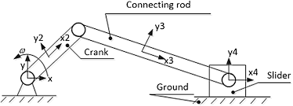
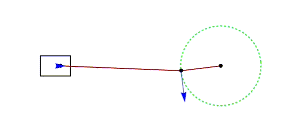

import MechanicsOfMaterialsComments from '../../../../components/mechanics-of-materials/MechanicsOfMaterialsComments.astro';
import TawkWidget from '../../../../components/TawkWidget.astro';
import UniversalContentContributors from '../../../../components/UniversalContentContributors.astro';
import Copyright from '../../../../components/Copyright.astro';
import BionicText from '../../../../components/BionicText.astro';
import TailwindWrapper from '../../../../components/TailwindWrapper.jsx';
import { Tabs, TabItem } from '@astrojs/starlight/components';
import { Card, CardGrid, Badge, Steps, LinkButton } from '@astrojs/starlight/components';

<UniversalContentContributors 
  contributors={frontmatter.contributors}
/>

## 🎯 Learning Objectives

By the end of this unit, you will be able to:

1. **Analyze** real-world mechatronic systems to identify critical components under stress
2. **Define and calculate** stress, strain, and material properties (Young's modulus, Poisson's ratio)
3. **Apply** Hooke's Law to predict material behavior under loading
4. **Solve** connecting rod stress problems during peak compression in crank-slider systems

## 🔧 Real-World System Problem: The Crank-Slider Mechanism

<BionicText method="advanced" intensity="medium" class="highlight">
Consider an internal combustion engine or reciprocating compressor. At the heart of these systems lies the crank-slider mechanism—one of the most fundamental motion conversion systems in mechanical engineering.
</BionicText>

  <TailwindWrapper>
	
  </TailwindWrapper>

### System Components and Function

The crank-slider mechanism consists of:
- **Crankshaft** (rotates continuously)
- **Connecting Rod** (experiences **`tension`** and **`compression`**)
- **Piston** (moves linearly back and forth)

> **Critical Question:** During the compression stroke of an engine, enormous forces act on the connecting rod. How do we ensure this rod won't fail under these extreme loads?

This is where **mechanics of materials** becomes essential. Without understanding **`stress`** and **`strain`**, we cannot:
- **`Predict`** if the connecting rod will buckle or break
- Choose appropriate **`materials`** (steel, aluminum, titanium)
- **`Optimize`** the rod's cross-sectional shape
- Ensure **`reliable`** operation over millions of cycles

### Why This System Matters in Mechatronics

Modern engines and compressors are **mechatronic systems** integrating:
- **Mechanical**: Crank-slider mechanism, valves, pistons
- **Electrical**: Ignition systems, fuel injectors, sensors
- **Control**: Engine management systems, timing control

But if the connecting rod fails mechanically, no amount of sophisticated control can save the system.

:::caution[Critical Design Insight]
In mechatronic systems, **mechanical failure modes often dominate over electrical or software failures**. A single mechanical component failure can render the entire system inoperable, making mechanics of materials analysis essential for system reliability.
:::

## 📚 Fundamental Theory: Stress, Strain, and Material Properties

Now that we understand **why** we need mechanics of materials, let's develop the theoretical foundation to analyze our connecting rod.

### What is Stress?

**Stress** is the internal resistance of a material to applied forces, measured as force per unit area:

<Card title="🔑 Fundamental Stress Formula" icon="document">
$$\sigma = \frac{F}{A}$$

**Where:**
- σ = Normal stress (Pa or N/m²)
- F = Applied force (N)
- A = Cross-sectional area (m²)

**Physical Meaning:** Force distributed over area - higher force or smaller area = higher stress
</Card>

<Tabs>
  <TabItem label="Types of Stress">
    
    **Normal Stress (σ):**
    - **Tensile**: Material is stretched (positive)
    - **Compressive**: Material is compressed (negative)
    
    **Shear Stress (τ):**
    - Forces act parallel to the surface
    - Causes angular deformation
    
  </TabItem>
  <TabItem label="Engineering Units">
    
    **Common Stress Units:**
    - Pascal (Pa) = N/m² = 1 Pa
    - Kilopascal (kPa) = 1,000 Pa
    - Megapascal (MPa) = 1,000,000 Pa
    - Gigapascal (GPa) = 1,000,000,000 Pa
    
    **Typical Values:**
    - Steel yield strength: ~250-400 MPa
    - Aluminum yield strength: ~70-500 MPa
    
  </TabItem>
</Tabs>

### What is Strain?

**Strain** is the measure of deformation—how much a material changes shape under stress:

<Card title="📐 Fundamental Strain Formula" icon="document">
$$\epsilon = \frac{\delta_L}{L_0}$$

**Where:**
- $\epsilon$ = Normal strain (dimensionless)
- $\delta_L$ = Change in length (m)
- $L_0$ = Original length (m)

**Physical Meaning:** Relative deformation - how much the material stretches or compresses compared to its original size
</Card>

### Hooke's Law: The Foundation of Linear Elasticity

For most engineering materials within their elastic range:

<Card title="⚖️ Hooke's Law - Linear Elasticity" icon="document">
$$\sigma = E \cdot \epsilon$$

**Where:**
- $E$ = Young's Modulus (Pa)
- Also written as: $F/A = E \cdot (\delta_L/L_0)$

**Physical Meaning:** Stress and strain are directly proportional in the elastic range. Young's Modulus represents material stiffness—how much stress is needed to produce a given strain.
</Card>

:::tip[Material Selection Insight]
<Badge text="Higher E = Stiffer Material" variant="tip" /> → Less deformation under load  
<Badge text="Lower E = More Flexible" variant="note" /> → More deformation, better for vibration damping
:::

### Poisson's Ratio: Lateral Strain Effects

When materials are stretched longitudinally, they contract laterally:

<Card title="🔄 Poisson's Ratio - Lateral Strain Effect" icon="document">
$$\nu = -\frac{\epsilon_{lateral}}{\epsilon_{longitudinal}}$$

**Where:**
- $\nu$ = Poisson's ratio (dimensionless)
- $\epsilon_{lateral}$ = Strain perpendicular to applied load
- $\epsilon_{longitudinal}$ = Strain in direction of applied load

**Physical Meaning:** When stretched in one direction, materials contract in perpendicular directions. Typical values: 0.25-0.35 for metals.
</Card>

:::note[Poisson's Ratio Applications]
- **ν ≈ 0.3** for most structural metals (steel, aluminum)
- **ν ≈ 0.5** for incompressible materials (rubber)
- **ν ≈ 0.2** for concrete and ceramics
- **Critical for** multi-axial stress analysis in complex geometries
:::

## 🔧 Application: Crank-Slider Connecting Rod Analysis

Now let's return to our crank-slider system and apply what we've learned to solve a real engineering problem.

  <TailwindWrapper>
	
  </TailwindWrapper>

:::note[Problem Statement]
**Crank-Slider Connecting Rod Stress Analysis**

**What we need to determine:**
1. **Peak compressive stress** in the connecting rod
2. **Safety factor** against material failure
3. **Deformation** of the rod under maximum load

**Key Question:** Is this connecting rod design safe for the given loading conditions, and how much will it deform?
:::

**System Parameters:**
- Four-stroke engine with crank-slider mechanism
- Steel connecting rod (critical component)
- Maximum compression force: F = 15,000 N
- Connecting rod cross-sectional area: A = 500 mm²
- Connecting rod length: L = 150 mm
- Material: Steel (E = 200 GPa, **`σ_yield`** = 350 MPa)

### Step 1: Calculate Peak Compressive Stress

**Click to reveal stress calculations**

<Steps>

1. **Apply the stress formula:**
   
   Using our fundamental stress formula:
   $$\sigma = \frac{F}{A} = \frac{15,000 \text{ N}}{500 \text{ mm}^2}$$
   
   Converting units: 500 mm² = 500 × 10⁻⁶ m²
   $$\sigma = \frac{15,000}{500 \times 10^{-6}} = 30,000,000 \text{ Pa} = 30 \text{ MPa}$$
   
   Peak compressive stress = **30 MPa**

</Steps>

### Step 2: Check Safety Factor

**Click to reveal safety factor analysis**

<Steps>

1. **Safety factor calculation:**
   
   Applied stress: σ = 30 MPa  
   Yield strength: σ_yield = 350 MPa
   Safety factor: SF = 350/30 = 11.7
   
   ✅ **Safe operation with SF = 11.7**

</Steps>

:::tip[Safety Factor Guidelines]
- **SF = 2-3**: Well-understood loading and materials
- **SF = 4-6**: Some uncertainty in loads or materials  
- **SF = 8-12**: High uncertainty or critical applications
- **SF > 15**: May indicate over-design (weight/cost penalty)
:::

### Step 3: Calculate Deformation

**Click to reveal deformation calculations**

<Steps>

1. **Calculate strain and deformation:**
   
   Strain: $\epsilon = \frac{\sigma}{E} = \frac{30 \times 10^6}{200 \times 10^9} = 0.00015$
   
   Deformation: $\delta = \epsilon \times L = 0.00015 \times 150 \text{ mm} = 0.0225 \text{ mm}$
   
   **Compression**: Only 0.023 mm—negligible for engine operation.

</Steps>

:::note[Deformation Analysis]
<Badge text="Elastic deformation" variant="tip" /> is usually **acceptable** in structural components

<Badge text="Permanent deformation" variant="caution" /> occurs beyond yield strength

<Badge text="Failure" variant="danger" /> occurs at ultimate tensile strength
:::

## 🎯 Key Material Properties for Mechatronics

<CardGrid>
  <Card title="Steel (Structural)">
    **E = 200 GPa**  
    High stiffness, moderate weight  
    Common in: Frames, shafts, gears
  </Card>
  <Card title="Aluminum (6061-T6)">
    **E = 70 GPa**  
    Lower stiffness, lightweight  
    Common in: Actuator housings, brackets
  </Card>
  <Card title="Carbon Fiber">
    **E = 150+ GPa**  
    High stiffness, very lightweight  
    Common in: Drone frames, precision arms
  </Card>
</CardGrid>

## 📋 Summary and Next Steps

In this unit, you learned to:

1. **Identify** critical mechanical components in mechatronic systems
2. **Define** stress (σ = F/A) and strain (ε = δ/L₀)
3. **Apply** Hooke's Law (σ = Eε) for elastic analysis  
4. **Solve** real connecting rod problems with safety factors

**Key Design Principles:**
- <Badge text="Strength Check" variant="success" />: σ_applied < σ_allowable
- <Badge text="Stiffness Check" variant="tip" />: δ_applied < δ_allowable  
- <Badge text="Fatigue Check" variant="caution" />: For cyclic loading
- <Badge text="Buckling Check" variant="danger" />: For compression members

:::tip[Mechatronic Design Philosophy]
**"Design for the weakest link"** - In complex mechatronic systems, identify and strengthen the component most likely to fail under normal operating conditions.
:::

**Coming Next**: In Lesson 1.2, we'll analyze an actuator shaft under axial loading, exploring how material selection affects performance in precision positioning systems.

<MechanicsOfMaterialsComments />
<TawkWidget />
<Copyright />