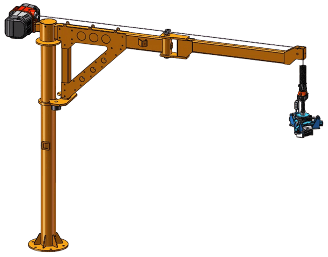
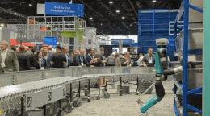

import MechanicsOfMaterialsComments from '../../../../components/mechanics-of-materials/MechanicsOfMaterialsComments.astro';
import TawkWidget from '../../../../components/TawkWidget.astro';
import UniversalContentContributors from '../../../../components/UniversalContentContributors.astro';
import Copyright from '../../../../components/Copyright.astro';
import BionicText from '../../../../components/BionicText.astro';
import TailwindWrapper from '../../../../components/TailwindWrapper.jsx';
import { Tabs, TabItem } from '@astrojs/starlight/components';
import { Card, CardGrid, Badge, Steps, LinkButton } from '@astrojs/starlight/components';

<UniversalContentContributors 
  contributors={frontmatter.contributors}
/>

---

## 🎓 **Chapter 2: Structural Behavior in Motion and Force Transfer**

<BionicText method="advanced" intensity="medium" class="highlight">
Welcome to Chapter 2 of our mechanics of materials journey! We now transition from axial loading (tension, compression, torsion) to bending-dominated behavior. Here, we'll analyze how beams and structural elements respond to transverse loads, forming the foundation for understanding robotic arms, machine frames, and structural components in mechatronic systems.
</BionicText>

---

## 🎯 Learning Objectives

By the end of this lesson, you will be able to:

1. **Construct** <mark>shear force and bending moment diagrams</mark> for semi-automatic material handling robotic arms
2. **Identify** <mark>critical sections</mark> with maximum shear and moment values in material handling systems
3. **Apply** <mark>equilibrium principles</mark> to cantilever beam analysis under eccentric loading conditions
4. **Design** for both <mark>shear and bending failure modes</mark> in industrial robotic structures

## 🔧 Real-World System Problem: Semi-Automatic Material Handling Robotic Arm

<BionicText method="advanced" intensity="medium" class="highlight">
Semi-automatic material handling robotic arms must support substantial payloads while operators manually guide positioning. Understanding how forces and moments distribute along the arm structure under eccentric loading is crucial for preventing failure and ensuring safe operation during human-robot collaboration.
</BionicText>

  <TailwindWrapper>
	
  </TailwindWrapper>

### System Description

**Semi-Automatic Material Handling Robotic Arm Components:**
- **Fixed Base** (servo-controlled rotation joint with structural support)
- **Main Arm Structure** (2.5m cantilever beam supporting payload and end-effector)
- **End-Effector Assembly** (gripper or tool interface for material handling)
- **Manual Guidance System** (allows operator control for precise positioning)
- **Load Distribution** (structural components, motors, sensors along arm length)

### The Structural Challenge

The semi-automatic material handling arm acts as a **cantilever beam** experiencing complex loading from both structural and operational sources:

:::note[Material Handling Loading Conditions]
- **Structural self-weight** distributed along the 2.5m arm length (uniform load from motors, sensors, frame)
- **Payload concentration** at the end-effector (typical 120kg loads during material handling)
- **Eccentric loading moments** from irregularly shaped objects and operator positioning variability
- **Manual guidance forces** during human-robot collaborative positioning
- **Dynamic effects** from load pickup, transport, and placement operations
:::

> **Engineering Question:** How do we determine where the maximum bending stress occurs in this semi-automatic material handling arm under eccentric loading, and how do we size the structure to safely handle 120kg payloads with appropriate safety margins?

### Why Beam Analysis Matters in Material Handling Robotics

  <TailwindWrapper>
	
  </TailwindWrapper>

**Consequences of Poor Structural Design in Material Handling:**
- **Arm deflection** compromises load positioning accuracy and operator safety
- **Structural failure** causes expensive downtime and potential injury hazards
- **Excessive arm weight** reduces payload capacity and increases energy consumption
- **Insufficient stiffness** creates handling difficulties during manual guidance

**Benefits of Proper Beam Analysis in Material Handling Systems:**
- **Optimized structure** for handling 120kg payloads safely with minimal deflection
- **Predictable behavior** under eccentric loading conditions for operator confidence
- **Reliable operation** throughout full payload range with appropriate safety margins
- **Cost-effective design** balancing structural requirements with manufacturing economics

## 📚 Fundamental Theory: Shear Force and Bending Moment

### Basic Beam Concepts

When a beam is loaded transversely, internal forces develop to maintain equilibrium:

**Shear Force (V):** Internal force that resists sliding  
**Bending Moment (M):** Internal moment that resists rotation  
**Normal Force (N):** Internal axial force (usually zero in pure bending)

### Sign Conventions

<Tabs>
  <TabItem label="Shear Force Convention">
    
    **Positive Shear Force (+V):**
    - Left side of cut pushed **up** ⬆️
    - Right side of cut pushed **down** ⬇️
    - Creates clockwise rotation tendency ↻
    
    **Negative Shear Force (-V):**
    - Left side of cut pushed **down** ⬇️
    - Right side of cut pushed **up** ⬆️
    - Creates counterclockwise rotation tendency ↺
    
  </TabItem>
  <TabItem label="Bending Moment Convention">
    
    **Positive Bending Moment (+M):**
    - **Tension** on bottom fiber
    - **Compression** on top fiber
    - Beam curves upward (smile shape) 😊
    
    **Negative Bending Moment (-M):**
    - **Compression** on bottom fiber
    - **Tension** on top fiber  
    - Beam curves downward (frown shape) 😞
    
  </TabItem>
  <TabItem label="Load Directions">
    
    **Positive Load:**
    - **Upward** point loads ⬆️
    - **Upward** distributed loads ⬆️
    - **Counterclockwise** applied moments ↺
    
    **Negative Load:**
    - **Downward** point loads (most common) ⬇️
    - **Downward** distributed loads (self-weight) ⬇️
    - **Clockwise** applied moments ↻
    
  </TabItem>
</Tabs>

### Differential Relationships

The fundamental relationship between load, shear, and moment:

<Card title="📏 Beam Differential Equations" icon="document">
$$\frac{dV}{dx} = -w(x)$$

$$\frac{dM}{dx} = V(x)$$

**Where:**
- $w(x)$ = distributed load intensity (N/m)
- $V(x)$ = shear force at position x (N)  
- $M(x)$ = bending moment at position x (N·m)

**Physical Meaning:** These equations show how load affects shear force rate of change, and how shear force affects bending moment rate of change.
</Card>

:::tip[Key Insights]
1. **Slope of shear diagram = negative of applied load**
2. **Slope of moment diagram = shear force value**
3. **Maximum moment occurs where shear = 0**
4. **Point loads cause jumps in shear diagrams**
5. **Applied moments cause jumps in moment diagrams**
:::

## 🔧 Application: Semi-Automatic Robotic Arm Cantilever Analysis

Let's analyze a realistic semi-automatic material handling robotic arm step by step.

:::note[Problem Statement]
**Semi-Automatic Robotic Arm Material Handling Analysis**

**What we need to determine:**
1. **Reaction forces** at the fixed support base
2. **Shear force distribution** along the robotic arm length
3. **Bending moment distribution** along the robotic arm length
4. **Critical sections** with maximum shear and moment values

**Key Questions:** Where do the maximum shear force and bending moment occur in this semi-automatic robotic arm, and what are their values for structural design and servo motor selection?
:::

**System Parameters:**
- Semi-automatic robotic arm for material handling (cantilever beam)
- Maximum capacity: 200 kg, typical working load: 120 kg
- Length: L = 2500 mm (2.5 m working reach)
- Arm self-weight: 75 N/m (uniform distributed load from structural components, motors, sensors)
- Current payload: 1200 N (120 kg typical load - point load at tip)
- Applied moment at tip: 360 N·m (from eccentric loading - explained below)
- Support: Fixed robotic base (servo-controlled rotation joint)

**Load Directions and Sign Convention:**
- Distributed load: **`w`** = 75 N/m (magnitude, acts downward as -75 N/m)
- Point load at tip: **`P`** = 1200 N (magnitude, acts downward as -1200 N)  
- Applied moment at tip: **`M₀`** = 360 N·m (counterclockwise positive)

**Understanding the Applied Moment:**
The 360 N·m moment at the tip represents **unintentional eccentric loading** common in real material handling operations. During manual positioning, loads are often placed with offset centers of gravity:
- **Irregularly shaped objects**: Castings, forgings, or machined parts with non-uniform mass distribution
- **Operator variability**: Different operators naturally position loads slightly off-center during manual guidance
- **Real-world example**: 120 kg load positioned 0.3 m off-center → M₀ = 1200 N × 0.3 m = 360 N·m
- This moment tries to **rotate the arm tip**, requiring structural resistance and affecting servo motor sizing

<LinkButton href="/product-development/robotic-arm-cantilever-analysis/" variant="primary" icon="puzzle" iconPlacement="start">
Interactive Beam Analysis
</LinkButton>

### Step 1: Calculate Reaction Forces

**Click to reveal reaction force calculations**

<Steps>

1. **Sum of vertical forces (↑ positive):**
   
   $$\sum F_y = 0: R_y - 75(2.5) - 1200 = 0$$
   
   **Reasoning:** 
   - $R_y$ = upward reaction (positive)
   - $75(2.5) = 187.5\ N$ = total distributed load (downward, negative)
   - $1200\ N$ = point load (downward, negative)
   
   $$R_y = 187.5 + 1200 = 1387.5 \text{ N (upward)}$$

2. **Sum of moments about base (counterclockwise positive):**
   
   $$\sum M_{base} = 0: M_{base} - 75(2.5)(1.25) - 1200(2.5) - 360 = 0$$
   
   **Reasoning:** 
   - $M_{base}$ = base reaction moment (counterclockwise, positive)
   - $75(2.5)(1.25) = 234.375\ N·m$ = distributed load moment (clockwise, negative)
   - $1200(2.5) = 3000\ N·m$ = point load moment (clockwise, negative)
   - $360\ N·m$ = applied tip moment (counterclockwise, but creates opposing base reaction)
   
   $$M_{base} = 234.375 + 3000 + 360 = 3594.375 \text{ N·m (counterclockwise)}$$

3. **Verify equilibrium:**
   
   Forces: ↑1387.5 N = ↓(187.5 + 1200) N ✅
   Moments: 3594.4 N·m = 3594.4 N·m ✅

</Steps>

### Step 2: Construct Shear Force Diagram

**Method:** Cut the beam at distance x from base and analyze equilibrium.

**For 0 ≤ x ≤ 2.5 m:**

<Card title="🛡️ Shear Force Equation" icon="document">
$$V(x) = R_y - w \cdot x = 1387.5 - 75x$$

**Where:**
- $R_y$ = Reaction force at support (N)
- $w$ = Distributed load intensity (N/m)
- $x$ = Distance from fixed support (m)

**Physical Meaning:** Shear force decreases linearly along the robotic arm length due to the cumulative effect of distributed loading from structural components, motors, and sensors.
</Card>

**Key points:**
- At x = 0: V(0) = 1387.5 N
- At x = 2.5 m: V(2.5) = 1387.5 - 75(2.5) = 1200 N

**Jump at tip from point load:**  
Just before tip: V = 1200 N  
Just after tip: V = 1200 - 1200 = 0 N ✅

:::tip[Shear Force Diagram Characteristics]
- **Linear decrease** due to uniform distributed load
- **Sudden jump down** of 1200 N at the tip due to payload
- **Maximum shear** occurs at the fixed support (1387.5 N)
:::

### Step 3: Construct Bending Moment Diagram

**Method:** Integrate shear force or use moment equilibrium.

**For 0 ≤ x ≤ 2.5 m:**

<Card title="⚖️ Bending Moment Equation" icon="document">
$$M(x) = M_{base} - R_y \cdot x + w \cdot x \cdot \frac{x}{2}$$

$$M(x) = 3594.375 - 1387.5x + 37.5x^2$$

**Where:**
- $M_{base}$ = Reaction moment at fixed support (N·m)
- Second term = Moment due to reaction force
- Third term = Moment due to distributed load

**Physical Meaning:** Bending moment varies quadratically due to distributed loading from robotic arm components, with contributions from support reactions and applied payload moments.
</Card>

**Key points:**
- At x = 0: M(0) = 3594.375 N·m (reaction moment)
- At x = 2.5 m: M(2.5) = 3594.375 - 1387.5(2.5) + 37.5(2.5)² = 3594.375 - 3468.75 + 234.375 = 360 N·m

**Applied moment effect at tip:**
At the free end (x = 2.5 m), the internal moment must balance the applied external moment. From our equation: M(2.5) = 360 N·m, which exactly balances the 360 N·m applied moment from eccentric loading, satisfying equilibrium at the tip: 360 - 360 = 0 ✅

### Step 4: Find Critical Sections

**Click to reveal critical section analysis**

<Steps>

1. **Maximum shear location:**
   
   Maximum |V| = 1387.5 N at x = 0 (fixed support)

2. **Maximum moment location:**
   
   For cantilever beams with downward loading, the maximum moment typically occurs at the **fixed support**. Let's verify by checking the boundary values:
   
   - At x = 0 (support): M(0) = 3594.4 N·m
   - At x = 2.5 m (tip): M(2.5) = 360 N·m
   
   **Maximum |M|** = 3594.4 N·m at x = 0 (fixed support)
   
   **Note:** Setting dM/dx = V(x) = 0 gives x = 18.5 m, but this point is far beyond our 2.5m material handling arm length and would represent a stationary point, not necessarily a maximum. For material handling cantilever arms with downward loads, always check the fixed support first.

</Steps>

## 📊 Design Analysis Summary

<CardGrid>
  <Card title="Critical Shear Section" icon="warning">
    **Location:** x = 0 (fixed support)  
    **Shear Force:** V = 1387.5 N  
    **Design Requirement:** Size for shear strength  
    **Status:** <Badge text="Check shear stress" variant="caution" />
  </Card>
  <Card title="Critical Moment Section" icon="error">
    **Location:** x = 0 (fixed support)  
    **Bending Moment:** M = 3594.4 N·m  
    **Design Requirement:** Size for bending strength  
    **Status:** <Badge text="Check bending stress" variant="danger" />
  </Card>
  <Card title="Tip Deflection" icon="information">
    **Location:** x = 2.5 m (free end)  
    **Expected:** Maximum deflection  
    **Design Consideration:** Accuracy requirements  
    **Status:** <Badge text="Check deflection limits" variant="note" />
  </Card>
</CardGrid>

## 🎯 Advanced Analysis: Complex Loading Scenarios

### Multiple Point Loads

Real robotic arms often carry multiple tools or components:

**Example Loading:**
- Tool changer: 400 N at x = 1.5 m
- End-effector: 500 N at x = 2.5 m  
- Distributed self-weight: 75 N/m

:::tip[Superposition Principle]
For multiple loads, analyze each load separately and **add the results**:
- V_total(x) = V_load1(x) + V_load2(x) + V_distributed(x)
- M_total(x) = M_load1(x) + M_load2(x) + M_distributed(x)
:::

### Dynamic Loading Effects

During robot motion, additional forces develop:

<Tabs>
  <TabItem label="Acceleration Effects">
    
    **Inertial Forces:**
    - Angular acceleration: α (rad/s²)
    - Additional loading: F_inertial = m·a
    - Direction: Opposite to acceleration
    
    **Design Factor:** Multiply static loads by 1.5-3.0
    
  </TabItem>
  <TabItem label="Vibration Considerations">
    
    **Natural Frequency:**
    - Avoid resonance with drive frequencies
    - Higher stiffness → higher natural frequency
    - Lower mass → higher natural frequency
    
    **Damping:** Material and joint damping reduce vibrations
    
  </TabItem>
  <TabItem label="Impact Loading">
    
    **Emergency Stops:**
    - High deceleration creates large inertial forces
    - Safety factor: 5-10× normal operation
    
    **Collision Detection:** Limit impact forces
    
  </TabItem>
</Tabs>

## 🛠️ Design Guidelines for Robotic Structures

### Cross-Section Optimization

**Bending-Dominated Design:**
- **Maximize section modulus** (I/c) for bending strength
- **Hollow sections** provide high stiffness-to-weight ratio
- **Rectangular tubes** offer good torsional and bending properties

**Common Material Handling Arm Cross-Sections:**
1. **Hollow rectangular:** Good for bending in multiple directions
2. **Hollow circular:** Excellent for torsion, good for bending  
3. **I-beams:** Maximum bending efficiency, but poor torsion
4. **Custom extrusions:** Optimized for specific load patterns

### Material Selection Strategy

:::note[Material Handling Arm Materials]
**Aluminum Alloys:**
- Excellent strength-to-weight ratio
- Good machinability and weldability
- Moderate cost
- **Most common choice**

**Carbon Fiber Composites:**
- Highest stiffness-to-weight ratio
- Excellent fatigue resistance
- High cost, complex manufacturing
- **High-performance applications**

**Steel:**
- High strength and stiffness
- Heavy weight reduces payload
- Low cost
- **Heavy-duty applications only**
:::

## 📋 Summary and Next Steps

In this lesson, you learned to:

1. **Construct** shear force diagrams using V = ΣF_y and dV/dx = -w
2. **Build** bending moment diagrams using M relationships and dM/dx = V  
3. **Identify** critical sections for maximum shear and moment
4. **Apply** equilibrium principles to cantilever beam analysis

**Key Design Insights:**
- <Badge text="Maximum moment often occurs at supports" variant="note" />
- <Badge text="Shear jumps at point loads, moment jumps at applied moments" variant="tip" />
- <Badge text="Distributed loads create linear shear and parabolic moment curves" variant="tip" />

**Critical Relationships:**
- **Load-Shear:** dV/dx = -w(x)
- **Shear-Moment:** dM/dx = V(x)
- **Maximum moment:** Occurs where V(x) = 0

**Coming Next**: In Lesson 2.2, we'll calculate the actual bending stresses in our semi-automatic material handling arm, using the moment values from this lesson to determine if the structure can safely carry the 120kg payloads with appropriate safety factors.

<MechanicsOfMaterialsComments />
<TawkWidget />
<Copyright />