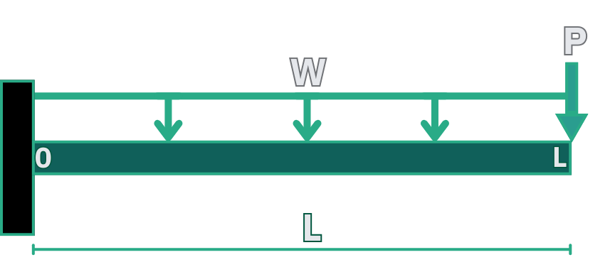

import MechanicsOfMaterialsComments from '../../../../components/mechanics-of-materials/MechanicsOfMaterialsComments.astro';
import TawkWidget from '../../../../components/TawkWidget.astro';
import UniversalContentContributors from '../../../../components/UniversalContentContributors.astro';
import Copyright from '../../../../components/Copyright.astro';
import BionicText from '../../../../components/BionicText.astro';
import TailwindWrapper from '../../../../components/TailwindWrapper.jsx';
import { Tabs, TabItem } from '@astrojs/starlight/components';
import { Card, CardGrid, Badge, Steps, LinkButton } from '@astrojs/starlight/components';

<UniversalContentContributors 
  contributors={frontmatter.contributors}
/>

---

## 🎓 **Chapter 2: Structural Behavior in Motion and Force Transfer**

<BionicText method="advanced" intensity="medium" class="highlight">
Welcome to Chapter 2 of our mechanics of materials journey! We now transition from axial loading (tension, compression, torsion) to bending-dominated behavior. Here, we'll analyze how beams and structural elements respond to transverse loads, forming the foundation for understanding robotic arms, machine frames, and structural components in mechatronic systems.
</BionicText>

---

## 🎯 Learning Objectives

By the end of this lesson, you will be able to:

1. **Construct** <Badge text="shear force and bending moment diagrams" variant="caution" /> for semi-automatic material handling robotic arms
2. **Identify** <Badge text="critical sections" variant="caution" /> with maximum shear and moment values in material handling systems
3. **Apply** <Badge text="equilibrium principles" variant="caution" /> to cantilever beam analysis under eccentric loading conditions
4. **Design** for both <Badge text="shear and bending failure modes" variant="caution" /> in industrial robotic structures

## 🔧 Real-World System Problem: Semi-Automatic Material Handling Robotic Arm

<BionicText method="advanced" intensity="medium" class="highlight">
Semi-automatic material handling robotic arms must support substantial payloads while operators manually guide positioning. Understanding how forces and moments distribute along the arm structure under eccentric loading is crucial for preventing failure and ensuring safe operation during human-robot collaboration.
</BionicText>

  <TailwindWrapper>
	
  </TailwindWrapper>

### System Description

**Semi-Automatic Material Handling Robotic Arm Components:**
- **Fixed Base** (servo-controlled rotation joint with structural support)
- **Main Arm Structure** (2.5m cantilever beam supporting payload and end-effector)
- **End-Effector Assembly** (gripper or tool interface for material handling)
- **Manual Guidance System** (allows operator control for precise positioning)
- **Load Distribution** (structural components, motors, sensors along arm length)

### The Structural Challenge

The semi-automatic material handling arm acts as a **cantilever beam** experiencing complex loading from both structural and operational sources:

:::note[Material Handling Loading Conditions]
- **Structural self-weight** distributed along the 2.5m arm length (uniform load from motors, sensors, frame)
- **Payload concentration** at the end-effector (typical 120kg loads during material handling)
- **Manual guidance forces** during human-robot collaborative positioning  
- **Dynamic effects** from load pickup, transport, and placement operations
:::

> **Engineering Question:** How do we determine where the maximum bending stress occurs in this semi-automatic material handling arm under loading, and how do we size the structure to safely handle typical payloads with appropriate safety margins?

### Why Beam Analysis Matters in Material Handling Robotics

**Consequences of Poor Structural Design in Material Handling:**
- **Arm deflection** compromises load positioning accuracy and operator safety
- **Structural failure** causes expensive downtime and potential injury hazards
- **Excessive arm weight** reduces payload capacity and increases energy consumption
- **Insufficient stiffness** creates handling difficulties during manual guidance

**Benefits of Proper Beam Analysis in Material Handling Systems:**
- **Optimized structure** for handling 120kg payloads safely with minimal deflection
- **Predictable behavior** under loading conditions for operator confidence  
- **Reliable operation** throughout full payload range with appropriate safety margins
- **Cost-effective design** balancing structural requirements with manufacturing economics

## 📚 Fundamental Theory: Shear Force and Bending Moment

### Basic Beam Concepts

When a beam is loaded transversely, internal forces develop to maintain equilibrium:

**Shear Force (V):** Internal force that resists sliding  
**Bending Moment (M):** Internal moment that resists rotation  
**Normal Force (N):** Internal axial force (usually zero in pure bending)

### Sign Conventions

<Tabs>
  <TabItem label="Shear Force Convention">
    
    **Positive Shear Force (+V):**
    - Left side of cut pushed **up** ⬆️
    - Right side of cut pushed **down** ⬇️
    - Creates clockwise rotation tendency ↻
    
    **Negative Shear Force (-V):**
    - Left side of cut pushed **down** ⬇️
    - Right side of cut pushed **up** ⬆️
    - Creates counterclockwise rotation tendency ↺
    
  </TabItem>
  <TabItem label="Bending Moment Convention">
    
    **Positive Bending Moment (+M):**
    - **Tension** on bottom fiber
    - **Compression** on top fiber
    - Beam curves upward (smile shape) 😊
    
    **Negative Bending Moment (-M):**
    - **Compression** on bottom fiber
    - **Tension** on top fiber  
    - Beam curves downward (frown shape) 😞
    
  </TabItem>
  <TabItem label="Load Directions">
    
    **Positive Load:**
    - **Upward** point loads ⬆️
    - **Upward** distributed loads ⬆️
    - **Counterclockwise** applied moments ↺
    
    **Negative Load:**
    - **Downward** point loads (most common) ⬇️
    - **Downward** distributed loads (self-weight) ⬇️
    - **Clockwise** applied moments ↻
    
  </TabItem>
</Tabs>

### Differential Relationships

The fundamental relationship between load, shear, and moment:

<Card title="📏 Beam Differential Equations" icon="document">
$$\frac{dV}{dx} = -w(x)$$

$$\frac{dM}{dx} = V(x)$$

**Where:**
- $w(x)$ = distributed load intensity (N/m)
- $V(x)$ = shear force at position x (N)  
- $M(x)$ = bending moment at position x (N·m)

**Physical Meaning:** These equations show how load affects shear force rate of change, and how shear force affects bending moment rate of change.
</Card>

:::tip[Key Insights]
1. **Slope of shear diagram = negative of applied load**
2. **Slope of moment diagram = shear force value**
3. **Maximum moment occurs where shear = 0**
4. **Point loads cause jumps in shear diagrams**
5. **Applied moments cause jumps in moment diagrams**
:::

## 🔧 Application 1: Semi-Automatic Robotic Arm Cantilever Analysis

A material handling robotic arm is modeled as a cantilever beam carrying both its own weight and a payload at the tip.

:::note[Problem Statement]

  <TailwindWrapper>
	
  </TailwindWrapper>

**Given:**
- Cantilever arm length: L = 2.5 m
- Distributed load: w = 75 N/m (arm self-weight)  
- Point load at tip: P = 1200 N (payload)

**Find:** Maximum shear force, maximum bending moment, and their locations.
:::

### Step 1: Calculate Reaction Forces

**Click to reveal reaction force calculations**

<Steps>

1. **Sum of vertical forces (↑ positive):**
   
   $$\sum F_y = 0: R_y - 75(2.5) - 1200 = 0$$
   
   **Reasoning:** 
   - $R_y$ = upward reaction (positive)
   - $75(2.5) = 187.5\ N$ = total distributed load (downward, negative) ✅
   - $1200\ N$ = point load (downward, negative) ✅
   
   $$R_y = 187.5 + 1200 = 1387.5 \text{ N (upward)}$$ ✅

2. **Sum of moments about base (counterclockwise positive):**
   
   $$\sum M_{base} = 0: M_{base} - 75(2.5)(1.25) - 1200(2.5) = 0$$
   
   **Reasoning:** 
   - $M_{base}$ = base reaction moment (counterclockwise, positive)
   - $75(2.5)(1.25) = 234.375\ N·m$ = distributed load moment (clockwise, negative) ✅
   - $1200(2.5) = 3000\ N·m$ = point load moment (clockwise, negative) ✅
   
   $$M_{base} = 234.375 + 3000 = 3234.375 \text{ N·m (counterclockwise)}$$ ✅

3. **Verify equilibrium:**
   
   Forces: ↑1387.5 N = ↓(187.5 + 1200) N ✅
   Moments: 3234.375 N·m = 3234.375 N·m ✅

</Steps>

### Step 2: Construct Shear Force Diagram

**Click to reveal shear force analysis**

**Method:** Cut the beam at distance x from base and analyze equilibrium.

**For 0 ≤ x ≤ 2.5 m:**

<Card title="🛡️ Shear Force Equation" icon="document">
$$V(x) = -(wL + P) + w \cdot x = -(75 \times 2.5 + 1200) + 75x = -1387.5 + 75x$$

**Where:**
- $w$ = Distributed load intensity (75 N/m)
- $L$ = Beam length (2.5 m)
- $P$ = Point load (1200 N)
- $x$ = Distance from fixed support (m)

**Physical Meaning:** For cantilever beams with downward loads, shear force starts negative (representing the total downward load) and becomes less negative as distributed load is "taken up" along the length.
</Card>

**Key points:**
- At x = 0: V(0) = -1387.5 N (negative, as expected for downward loads) ✅
- At x = 2.5 m: V(2.5) = -1387.5 + 75(2.5) = -1200 N ✅

**Jump at tip from point load:**  
Just before tip: V = -1200 N  
Just after tip: V = -1200 + 1200 = 0 N ✅

:::tip[Shear Force Diagram Characteristics]
- **Negative values throughout** due to downward loading
- **Linear increase** (becomes less negative) due to distributed load being "taken up"
- **Sudden jump up** of 1200 N at the tip due to payload
- **Maximum |shear|** occurs at the fixed support (1387.5 N)
:::

### Step 3: Construct Bending Moment Diagram

**Click to reveal bending moment analysis**

**Method:** Integrate shear force or use moment equilibrium.

**For 0 ≤ x ≤ 2.5 m:**

<Card title="⚖️ Bending Moment Equation" icon="document">
$$M(x) = -M_{base} + R_y \cdot x - w \cdot x \cdot \frac{x}{2}$$

$$M(x) = -3234.375 + 1387.5x - 37.5x^2$$

**Where:**
- $M_{base}$ = Reaction moment at fixed support (3234.375 N·m)
- Second term = Moment due to reaction force
- Third term = Moment due to distributed load

**Physical Meaning:** Bending moment varies quadratically due to distributed loading from robotic arm components. The negative sign indicates sagging (compression on top, tension on bottom).
</Card>

**Key points:**
- At x = 0: M(0) = -3234.375 N·m (negative = sagging moment at fixed end) ✅
- At x = 2.5 m: M(2.5) = -3234.375 + 1387.5(2.5) - 37.5(2.5)² = -3234.375 + 3468.75 - 234.375 = 0 N·m ✅

**Free end boundary condition:**
At the free end (x = 2.5 m), the internal moment must be zero since there are no applied moments. Our equation gives M(2.5) = 0, confirming equilibrium at the tip ✅

### Step 4: Find Critical Sections

**Click to reveal critical section analysis**

<Steps>

1. **Maximum shear location:**
   
   Maximum |V| = 1387.5 N at x = 0 (fixed support) ✅

2. **Maximum moment location:**
   
   For cantilever beams with downward loading, the maximum moment typically occurs at the **fixed support**. Let's verify by checking the boundary values:
   
   - At x = 0 (support): |M(0)| = 3234.375 N·m ✅
   - At x = 2.5 m (tip): |M(2.5)| = 0 N·m ✅
   
   **Maximum |M|** = 3234.375 N·m at x = 0 (fixed support) ✅
   
   **Note:** Setting dM/dx = V(x) = 0 gives -1387.5 + 75x = 0, so x = 18.5 m, but this point is beyond our 2.5m arm length. For cantilever arms with downward loads, maximum moment always occurs at the fixed support.

</Steps>

## 🔧 Application 2: CNC Machine Spindle Housing

A simply supported beam carries a rotating spindle with concentrated loads from motor reactions and cutting forces.

:::note[Problem Statement]
**Given:**
- Simply supported beam length: L = 1200 mm
- Motor reaction force: P₁ = 800 N at x = 400 mm
- Cutting force: P₂ = 1200 N at x = 900 mm
- Support conditions: Simply supported at both ends

**Find:** Maximum shear force, maximum bending moment, and their locations.
:::

### Step 1: Calculate Reaction Forces

**Click to reveal reaction force calculations**

1. **Sum of vertical forces (↑ positive):**
   
   $$\sum F_y = 0: R_A + R_B - 800 - 1200 = 0$$
   
   $$R_A + R_B = 2000 \text{ N}$$ ✅

2. **Sum of moments about A (counterclockwise positive):**
   
   $$\sum M_A = 0: R_B(1200) - 800(400) - 1200(900) = 0$$
   
   $$R_B(1200) = 320,000 + 1,080,000 = 1,400,000$$
   
   $$R_B = \frac{1,400,000}{1200} = 1166.7 \text{ N}$$ ✅

3. **Calculate R_A:**
   
   $$R_A = 2000 - 1166.7 = 833.3 \text{ N}$$ ✅

### Step 2: Construct Shear Force Diagram

**Click to reveal shear force analysis**

**For 0 ≤ x ≤ 400 mm:**
$$V(x) = R_A = 833.3 \text{ N}$$ ✅

**For 400 mm ≤ x ≤ 900 mm:**
$$V(x) = R_A - P_1 = 833.3 - 800 = 33.3 \text{ N}$$ ✅

**For 900 mm ≤ x ≤ 1200 mm:**
$$V(x) = R_A - P_1 - P_2 = 833.3 - 800 - 1200 = -1166.7 \text{ N}$$ ✅

**Key points:**
- At x = 0: V = 833.3 N ✅
- Just before x = 400 mm: V = 833.3 N ✅
- Just after x = 400 mm: V = 33.3 N ✅
- Just before x = 900 mm: V = 33.3 N ✅ 
- Just after x = 900 mm: V = -1166.7 N ✅
- At x = 1200 mm: V = -1166.7 N ✅

**Maximum shear force:** |V_max| = 1166.7 N between x = 900-1200 mm ✅

### Step 3: Construct Bending Moment Diagram

**Click to reveal bending moment analysis**

**For 0 ≤ x ≤ 400 mm:**
$$M(x) = R_A \cdot x = 833.3x$$ ✅

**For 400 mm ≤ x ≤ 900 mm:**
$$M(x) = R_A \cdot x - P_1(x - 400) = 833.3x - 800(x - 400) = 33.3x + 320,000$$ ✅

**For 900 mm ≤ x ≤ 1200 mm:**
$$M(x) = R_A \cdot x - P_1(x - 400) - P_2(x - 900)$$
$$M(x) = 833.3x - 800(x - 400) - 1200(x - 900) = -1166.7x + 1,400,000$$ ✅

**Key points:**
- At x = 0: M(0) = 0 N·mm ✅
- At x = 400 mm: M(400) = 833.3(400) = 333,320 N·mm ✅
- At x = 900 mm: M(900) = 33.3(900) + 320,000 = 349,970 N·mm ✅
- At x = 1200 mm: M(1200) = 0 N·mm ✅

**Maximum bending moment:** M_max = 349,970 N·mm = 350 N·m at x = 900 mm ✅

## 🔧 Application 3: Server Rack Cable Tray

A horizontal cable tray in a data center is fixed at both ends and carries uniformly distributed cables and equipment.

:::note[Problem Statement]
**Given:**
- Fixed-fixed beam length: L = 2000 mm
- Cable weight: w = 25 N/m (uniformly distributed)
- Support conditions: Fixed at both ends

**Find:** Maximum shear force, maximum bending moment, and their locations.
:::

### Step 1: Calculate Reaction Forces

**Click to reveal reaction force calculations**

For fixed-fixed beam with uniform distributed load:

1. **Sum of vertical forces (↑ positive):**
   
   $$\sum F_y = 0: R_A + R_B - wL = 0$$
   
   By symmetry: $$R_A = R_B = \frac{wL}{2} = \frac{25 \times 2000}{2} = 25,000 \text{ N}$$ ✅

2. **Reaction moments (from fixed-fixed beam theory):**
   
   $$M_A = M_B = \frac{wL^2}{12} = \frac{25 \times (2000)^2}{12} = 8,333,333 \text{ N·mm} = 8.33 \text{ kN·m}$$ ✅

### Step 2: Construct Shear Force Diagram

**Click to reveal shear force analysis**

**For 0 ≤ x ≤ 2000 mm:**

$$V(x) = R_A - wx = 25,000 - 25x$$

**Key points:**
- At x = 0: V(0) = 25,000 N ✅
- At x = 1000 mm: V(1000) = 25,000 - 25(1000) = 0 N ✅
- At x = 2000 mm: V(2000) = 25,000 - 25(2000) = -25,000 N ✅

**Maximum shear force:** |V_max| = 25,000 N at both supports ✅

### Step 3: Construct Bending Moment Diagram

**Click to reveal bending moment analysis**

**For 0 ≤ x ≤ 2000 mm:**

$$M(x) = M_A + R_A x - w\frac{x^2}{2} = -8,333,333 + 25,000x - 12.5x^2$$

**Key points:**
- At x = 0: M(0) = -8,333,333 N·mm = -8.33 kN·m ✅
- At x = 1000 mm: M(1000) = -8,333,333 + 25,000(1000) - 12.5(1000)² = 4.17 kN·m ✅  
- At x = 2000 mm: M(2000) = -8.33 kN·m ✅

**Maximum positive moment:** M_max = 4.17 kN·m at center ✅
**Maximum negative moment:** |M_max| = 8.33 kN·m at supports ✅

## 🔧 Application 4: Robotic Gripper Jaw Analysis

A robotic gripper jaw grips objects of varying sizes and weights, creating distributed and concentrated loads on the cantilever jaw structure.

:::note[Problem Statement]
**Given:**
- Cantilever jaw length: L = 120 mm
- Gripping force (concentrated): P = 300 N at x = 100 mm
- Jaw weight (distributed): w = 5 N/m along entire length
- Cross-section: Rectangular aluminum, 20 mm × 15 mm

**Find:** Complete shear force and bending moment analysis with maximum values.
:::

### Step 1: Calculate Reaction Forces

**Click to reveal reaction force calculations**

1. **Sum of vertical forces (↑ positive):**
   
   $$\sum F_y = 0: R_y - wL - P = 0$$
   
   $$R_y = 5 \times 0.12 + 300 = 0.6 + 300 = 300.6 \text{ N}$$ ✅

2. **Sum of moments about base (counterclockwise positive):**
   
   $$\sum M_{base} = 0: M_{base} - wL \times \frac{L}{2} - P \times 100 = 0$$
   
   $$M_{base} = 0.6 \times 60 + 300 \times 100 = 36 + 30,000 = 30,036 \text{ N·mm}$$ ✅

### Step 2: Construct Shear Force Diagram

**Click to reveal shear force analysis**

**For 0 ≤ x ≤ 100 mm:**
$$V(x) = -wx = -5x \times 10^{-3} = -0.005x \text{ N}$$

**For 100 < x ≤ 120 mm:**
$$V(x) = -wx - P = -0.005x - 300 \text{ N}$$

**Key points:**
- At x = 0: V(0) = 0 N ✅
- At x = 100⁻: V(100⁻) = -0.005(100) = -0.5 N ✅
- At x = 100⁺: V(100⁺) = -0.5 - 300 = -300.5 N ✅
- At x = 120: V(120) = -0.005(120) - 300 = -300.6 N ✅

**Maximum shear force:** |V_max| = 300.6 N at fixed support ✅

### Step 3: Construct Bending Moment Diagram

**Click to reveal bending moment analysis**

**For 0 ≤ x ≤ 100 mm:**
$$M(x) = \int V(x)dx = \int(-0.005x)dx = -0.0025x^2 + C_1$$

**For 100 < x ≤ 120 mm:**
$$M(x) = \int(-0.005x - 300)dx = -0.0025x^2 - 300x + C_2$$

Applying boundary conditions M(120) = 0 and continuity at x = 100:
$$C_1 = 30,036 \text{ and } C_2 = 66,036$$

Therefore:
- **For 0 ≤ x ≤ 100:** $$M(x) = -0.0025x^2 + 30,036$$ ✅
- **For 100 < x ≤ 120:** $$M(x) = -0.0025x^2 - 300x + 66,036$$ ✅

**Key points:**
- At x = 0: M(0) = 30,036 N·mm = 30.04 N·m ✅
- At x = 120: M(120) = 0 N·m ✅

**Maximum bending moment:** M_max = 30.04 N·m at fixed support ✅

## 📋 Summary and Next Steps

In this lesson, you learned to:

1. **Construct** shear force diagrams using V = ΣF_y and dV/dx = -w
2. **Build** bending moment diagrams using M relationships and dM/dx = V  
3. **Identify** critical sections for maximum shear and moment
4. **Apply** equilibrium principles to cantilever beam analysis

**Key Design Insights:**
- <Badge text="Maximum moment often occurs at supports" variant="note" />
- <Badge text="Shear jumps at point loads, moment jumps at applied moments" variant="tip" />
- <Badge text="Distributed loads create linear shear and parabolic moment curves" variant="tip" />

**Critical Relationships:**
- **Load-Shear:** dV/dx = -w(x)
- **Shear-Moment:** dM/dx = V(x)
- **Maximum moment:** Occurs where V(x) = 0

**Coming Next**: In Lesson 2.2, we'll calculate bending stresses in robotic cantilever gripper jaws using beam theory, applying the flexural formula to check if the jaws can safely support design loads.

<MechanicsOfMaterialsComments />
<TawkWidget />
<Copyright />